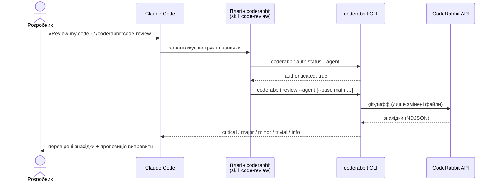
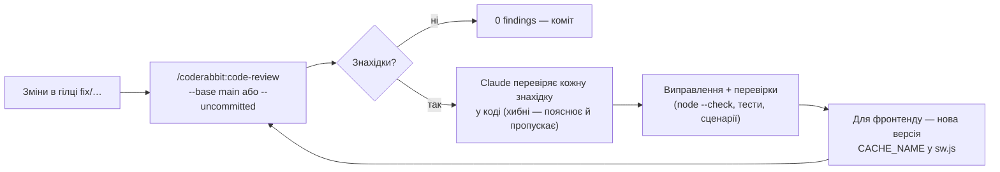

<div align="center">

# CodeRabbit × Claude Code — настанова для JS PROMPT

**Автоматичне AI-рев'ю коду promt.pp.ua (PWA + API) з Claude Code: встановлення, запуск, команди, робочий цикл**


*Версія документа 2.0 · 03.10.2026 · стосується JS PROMPT 2.0.0*

</div>

---

> [!TIP]
> **Коротко:** 1) CodeRabbit CLI встановлено **від користувача `promtops`** (під ним працює Claude Code на сервері);
> 2) `coderabbit auth login`; 3) у Claude Code увімкнено плагін `coderabbit`; 4) працюйте в репозиторії
> `/var/www/promt.pp.ua` ([§6](#6--репозиторій-promtppua)); 5) напишіть Claude **«Review my code»** або `/coderabbit:code-review`.

## Зміст

1. [Як це працює](#1--як-це-працює)
2. [Вимоги та поточний стан сервера](#2--вимоги-та-поточний-стан-сервера)
3. [Крок 1 — встановлення CodeRabbit CLI](#3--крок-1--встановлення-coderabbit-cli)
4. [Крок 2 — автентифікація і перша перевірка](#4--крок-2--автентифікація-і-перша-перевірка)
5. [Крок 3 — Claude Code і плагін coderabbit](#5--крок-3--claude-code-і-плагін-coderabbit)
6. [Репозиторій promt.pp.ua](#6--репозиторій-promtppua)
7. [Команди в Claude Code](#7--команди-в-claude-code)
8. [Команди CodeRabbit CLI](#8--команди-coderabbit-cli)
9. [Робочий цикл «рев'ю → виправлення → рев'ю»](#9--робочий-цикл-рев'ю--виправлення--рев'ю)
10. [Рев'ю всієї кодової бази](#10--рев'ю-всієї-кодової-бази)
11. [Усунення несправностей](#11--усунення-несправностей)
12. [Безпека](#12--безпека)

---

## 1 · Як це працює



CodeRabbit рев'юїть **git-дифф**, тому аналізуються лише зміни відносно бази порівняння
(гілки, коміту або робочого дерева). Claude Code викликає CLI, розбирає його вивід (NDJSON),
**перевіряє кожну знахідку в коді** і за вашою згодою виправляє. Аналіз виконує сервіс CodeRabbit.

---

## 2 · Вимоги та поточний стан сервера

| Що | Стан на сервері `vmi305798` | Перевірка |
|---|---|---|
| ОС | Debian GNU/Linux 12 (bookworm) | `cat /etc/debian_version` |
| git | 2.39.5 | `git --version` |
| CodeRabbit CLI | 0.8.2, `~/.local/bin/coderabbit` (користувач `promtops`) | `command -v coderabbit && coderabbit --version` |
| Акаунт CodeRabbit | GitHub-акаунт `bioluch`, регіон `us` | `coderabbit auth status` |
| Claude Code | десктопний застосунок Claude (вкладка **Code**), підключений до сервера по SSH як `promtops` | — |
| Плагін Claude Code | `coderabbit` 1.2.0 (навички `code-review`, `autofix`) | `/plugin` у Claude Code |
| Репозиторій | `/var/www/promt.pp.ua`, remote `git@github.com:bioluch/promt.pp.ua.git` | `git -C /var/www/promt.pp.ua remote -v` |

> [!WARNING]
> **Типова пастка:** CLI встановлено під `root`, а Claude Code працює від **`promtops`** — тоді для Claude
> CLI «не існує» або «не авторизований». CLI, вхід і Claude Code мають бути в **того самого** користувача.

---

## 3 · Крок 1 — встановлення CodeRabbit CLI

Усе нижче виконуйте від користувача **`promtops`**:

```bash
whoami            # очікувано: promtops
su - promtops     # якщо ви під root
```

Офіційне джерело — **https://docs.coderabbit.ai/cli**. Безпечний спосіб — завантажити скрипт,
переглянути й лише потім виконати (не передавайте віддалений скрипт одразу в `sh`):

```bash
curl -fsSL https://cli.coderabbit.ai/install.sh -o /tmp/coderabbit-install.sh
less /tmp/coderabbit-install.sh      # переглянути; вихід — клавіша q
sh /tmp/coderabbit-install.sh
```

CLI ставиться в `~/.local/bin/coderabbit` (поруч — короткий псевдонім `cr`). Додайте теку в `PATH`:

```bash
command -v coderabbit || echo 'export PATH="$HOME/.local/bin:$PATH"' >> ~/.bashrc
source ~/.bashrc
coderabbit --version       # 0.8.2 або новіша
coderabbit doctor          # діагностика встановлення та готовності до рев'ю
```

> [!NOTE]
> Оновлення: `coderabbit update`. Адресу скрипта звіряйте з офіційною документацією — вона може змінюватися.

---

## 4 · Крок 2 — автентифікація і перша перевірка

```bash
coderabbit auth login                 # вхід через браузер (OAuth)
coderabbit auth login --region eu     # якщо акаунт в EU-регіоні
coderabbit auth status                # перевірка
coderabbit auth status --agent        # структурований вивід (так перевіряє плагін)
coderabbit auth org                   # перемкнути організацію
coderabbit auth logout                # вийти
```

### 4.1 Вхід на сервері без браузера

`coderabbit auth login` друкує запасне посилання (fallback URL); параметр `state` щоразу інший,
тож копіюйте посилання саме з вашого терміналу:

```text
CodeRabbit login fallback URL: https://app.coderabbit.ai/login?client=cli&org_selection=workspace&state=<…>&redirect_uri=coderabbit-cli%3A%2F%2Fauth-callback
```

1. Відкрийте посилання в браузері на своєму комп'ютері й увійдіть через GitHub (`bioluch`).
2. Скопіюйте показаний токен і вставте **у термінал**, де чекає `auth login` — ніколи не в чат із Claude.
3. Перевірте: `coderabbit auth status` → `authenticated: true`.

> [!IMPORTANT]
> Claude **не вводить і не отримує** ваші облікові дані. Вхід виконуєте ви у своєму терміналі;
> плагін лише перевіряє `auth status --agent` і зупиняється, якщо вхід не виконано.

### 4.2 Перша перевірка

```bash
cd /var/www/promt.pp.ua
git status
git branch --show-current
coderabbit review
```

Якщо все закомічено й гілка збігається з `origin/main`, результат буде таким — це **нормально**:

```text
No changes detected
Nothing to review.
```

Немає диффу — немає що перевіряти. Порівнюйте з базою: `coderabbit review --base main` (для гілки)
або `--base-commit <sha>`; для перевірки всього коду див. [§10](#10--рев'ю-всієї-кодової-бази).

---

## 5 · Крок 3 — Claude Code і плагін coderabbit

### 5.1 Як підключено Claude Code

На promt.pp.ua Claude Code використовується з **десктопного застосунку Claude** (вкладка **Code**),
сесія відкривається на сервері по SSH від користувача `promtops` з робочою текою `/var/www/promt.pp.ua`.
Окремо встановлювати CLI `claude` на сервер не потрібно. Якщо потрібен термінальний варіант:

```bash
curl -fsSL https://claude.ai/install.sh -o /tmp/claude-install.sh
less /tmp/claude-install.sh
bash /tmp/claude-install.sh
source ~/.bashrc && claude --version
```

### 5.2 Плагін

У Claude Code (термінальному `claude` або в інтерфейсі плагінів десктопного застосунку):

```text
/plugin marketplace update
/plugin install coderabbit
```

Після встановлення (версія 1.2.0) з'являються:

| Компонент | Призначення |
|---|---|
| `/coderabbit:code-review` | навичка рев'ю (основна) |
| `/coderabbit:autofix` | виправлення за нерозв'язаними коментарями CodeRabbit у GitHub PR, з погодженням кожної зміни |
| субагент `coderabbit:code-reviewer` | рев'ю у власному контексті з поверненням знахідок за рівнями |
| субагент `coderabbit:autofix` | лише читає: збирає коментарі PR і готує план виправлень |
| тригери природною мовою | «Review my code», «Check for security issues», «Run coderabbit» |

> [!NOTE]
> Команду `/coderabbit:coderabbit-review` у плагіні 1.2.0 прибрано — використовуйте `/coderabbit:code-review`.
> Документація інтеграції: https://docs.coderabbit.ai/cli/claude-code-integration

> [!WARNING]
> Альтернативне встановлення навичок `npx skills add coderabbitai/skills -a claude-code` **у проєкт** створює
> `.claude/` у поточній теці. Не запускайте його в `/var/www/promt.pp.ua` (це docroot) — використовуйте `-g` (глобально).

---

## 6 · Репозиторій promt.pp.ua

| Параметр | Значення |
|---|---|
| Робоче дерево | `/var/www/promt.pp.ua` (одночасно docroot сайту) |
| Git-тека | `/var/www/promt.pp.ua/.git` |
| Remote | `origin` → `git@github.com:bioluch/promt.pp.ua.git` |
| Основна гілка | `main` |
| Робочі гілки | `fix/…`, `feature/…` (наприклад, `fix/coderabbit-review`) |
| Ігнорування | `.gitignore` (`.env`, `node_modules/`, `backups/`, логи, тимчасові файли) |

> [!IMPORTANT]
> Робоче дерево — це **публічний docroot**. Захист забезпечує nginx
> ([`deploy/nginx/promt.pp.ua.conf`](../deploy/nginx/promt.pp.ua.conf)): `/.git`, `.env` та інші dot-файли,
> `/db/`, `/mail/`, `/deploy/`, `/backups/`, `*.sql`, `*.gz`, `*.bak`, `*.log` віддають **404**.
> Перевірка: `curl -s -o /dev/null -w "%{http_code}\n" https://promt.pp.ua/.git/config` → `404`.

Рекомендований порядок роботи:

```bash
cd /var/www/promt.pp.ua
git checkout -b fix/<коротка-назва>      # ніколи не працюйте прямо в main
# … зміни …
coderabbit review --base main             # або в Claude Code: /coderabbit:code-review --base main
git add -A && git commit                  # після виправлення знахідок
```

> [!NOTE]
> Репозиторій `bioluch/promt.pp.ua` **не під'єднано до організації CodeRabbit**, тому CLI попереджає
> *«…is not connected to a CodeRabbit organization… this review will use the free CLI allowance»* —
> рев'ю йдуть з безкоштовного ліміту. Щоб рахувати їх організації, встановіть CodeRabbit для репозиторію на
> https://app.coderabbit.ai.

---

## 7 · Команди в Claude Code

| Що написати Claude | Що відбудеться |
|---|---|
| `Review my code` | рев'ю відстежуваних змін (типовий обсяг) |
| `/coderabbit:code-review` | те саме через слеш-команду |
| `/coderabbit:code-review --uncommitted` | лише незакомічені зміни |
| `/coderabbit:code-review --committed` | лише закомічені зміни |
| `/coderabbit:code-review --include-untracked` | + нові невідстежувані файли |
| `/coderabbit:code-review --base main` | уся гілка відносно `main` |
| `/coderabbit:code-review --base-commit <sha>` | порівняння з комітом |
| `/coderabbit:code-review --dir api` | лише зміни всередині теки `api/` |
| `Review my code and fix the issues` | автономний цикл: рев'ю → виправлення → повторне рев'ю |
| `/coderabbit:autofix` | виправлення з нерозв'язаних коментарів CodeRabbit у GitHub PR |
| `Check for security issues` | рев'ю з фокусом на безпеку |

Сумісність прапорців: `--committed` **не** поєднується з `--uncommitted` / `--include-untracked`;
`--base` **не** поєднується з `--base-commit`.

Рівні знахідок, які Claude зберігає без змін: **critical · major · minor · trivial · info · none**.
`status: review_skipped` означає, що рев'ю **не відбулося**, а не що код чистий.

---

## 8 · Команди CodeRabbit CLI

Звірено з CLI **0.8.2** (`coderabbit --help`, `coderabbit review --help`). Для іншої версії перевіряйте `--help`.

### 8.1 Рев'ю

| Команда | Опис |
|---|---|
| `coderabbit review` | рев'ю у звичайному (людському) форматі |
| `coderabbit review --agent` | вивід NDJSON для агентів (так викликає Claude) |
| `coderabbit review --uncommitted` / `--committed` | обсяг змін |
| `coderabbit review --include-untracked` | + невідстежувані файли |
| `coderabbit review --base <branch>` / `--base-commit <sha>` | база порівняння |
| `coderabbit review --dir <path>` | лише зміни всередині теки |
| `coderabbit review --deep [focus]` | повна політика рев'ю як для pull request (опційний фокус) |
| `coderabbit review --fresh` | без повторного використання попередньої локальної контрольної точки |
| `coderabbit review -c <files…>` | додаткові інструкції для рев'ю з файлів |
| `coderabbit review findings` | знахідки попереднього локального рев'ю |
| `coderabbit review --show-prompts` | AI-підказки для виправлень з останнього рев'ю (без нового рев'ю) |
| `coderabbit review --remote <owner/repo> --base main --source-branch <ref>` | рев'ю GitHub-репозиторію без локальної копії |
| `coderabbit usage` / `coderabbit review --usage` | використання ліміту |
| `coderabbit review --use-credits` | дозволити витрату додаткових кредитів |
| `coderabbit pullrequest <номер\|URL> --show-prompts --agent` | консолідовані підказки за GitHub PR |

> [!NOTE]
> Прапорця `--light` у CLI 0.8.2 **немає** (його можна зустріти в документації інших версій).

### 8.2 Обліковий запис, сервіс, налаштування

| Команда | Опис |
|---|---|
| `coderabbit auth login` · `auth status [--agent]` · `auth org` · `auth logout` | вхід, статус, організація, вихід |
| `coderabbit doctor` | діагностика встановлення й готовності до рев'ю |
| `coderabbit stats` | статистика рев'ю |
| `coderabbit update` | оновлення CLI |
| `coderabbit skills` | встановлення / оновлення навичок для агентів |
| `coderabbit config` | майстер налаштувань репозиторію |
| `coderabbit code …` | робота з хмарним Coding Agent CodeRabbit |

Повний довідник: https://docs.coderabbit.ai/cli/reference

---

## 9 · Робочий цикл «рев'ю → виправлення → рев'ю»



Обов'язкові перевірки перед комітом у цьому проєкті:

```bash
node --check api/server.js api/scheduler.js js/*.js sw.js
python3 -c "import json; json.load(open('manifest.json'))"
```

Після змін у `api/` перезапустіть сервіси: `sudo systemctl restart jsprompt-api jsprompt-scheduler`.

### 9.1 Реальна історія рев'ю promt.pp.ua (жовтень 2026)

| Етап | Обсяг | Результат |
|---|---|---|
| Повне рев'ю кодової бази ([§10](#10--рев'ю-всієї-кодової-бази)) | 47 текстових файлів | **32 знахідки**: 2 critical, 12 major, 18 minor — усі виправлено |
| Повторні рев'ю після виправлень | гілка `fix/coderabbit-review` | ще ~20 знахідок у нових змінах (виправлено; кілька хибних — пояснено) |
| Фінальне рев'ю гілки відносно `main` | 23 файли | **0 знахідок** |

Приклади знайдених і виправлених критичних проблем: ключ DeepSeek віддавався будь-якому користувачу
(`/api/env`), async-помилки Express 4 «вішали» запити, перевірку SQL перед відновленням бекапу можна було обійти.

> [!TIP]
> Просіть Claude **підтвердити** кожну знахідку в коді (а за можливості — відтворити тестом) перед виправленням.
> CodeRabbit іноді помиляється (наприклад, не бачить глобальної обгортки `wrapAsync`) — такі знахідки Claude
> має пояснити й пропустити, а не «виправляти».

---

## 10 · Рев'ю всієї кодової бази

CodeRabbit бачить лише дифф. Якщо весь код потрапив у перший (кореневий) коміт, `--base-commit` до нього не
допоможе. Рішення — тимчасова гілка від **порожнього** коміту, у якій увесь код виглядає однією зміною.
Робоче дерево `main` при цьому не змінюється:

```bash
cd /var/www/promt.pp.ua
EMPTY=$(git commit-tree $(git hash-object -t tree /dev/null) -m "cr: empty base")
FULL=$(git commit-tree HEAD^{tree} -p $EMPTY -m "cr: full snapshot")
git branch -f cr-empty-base $EMPTY && git branch -f cr-full-review $FULL
git worktree add /tmp/cr-wt cr-full-review
cd /tmp/cr-wt && coderabbit review --agent --base cr-empty-base > /tmp/cr-full.ndjson
cd /var/www/promt.pp.ua
git worktree remove /tmp/cr-wt && git branch -D cr-full-review cr-empty-base   # прибирання
```

Перед цим перевірте, що в коді **немає секретів** (CLI надішле весь код у CodeRabbit). Двійкові файли
(шрифти, зображення) CLI пропускає автоматично.

---

## 11 · Усунення несправностей

| Симптом | Причина | Рішення |
|---|---|---|
| Claude: «CodeRabbit CLI не встановлено» | CLI в іншого користувача / не в `PATH` | встановити під `promtops`; `command -v coderabbit` |
| `/coderabbit` — «немає такої команди» | неповна назва | `/coderabbit:code-review` |
| `/coderabbit:coderabbit-review` не знайдено | прибрано в плагіні 1.2.0 | `/coderabbit:code-review` |
| `No changes detected` / `Nothing to review` | дифф порожній | `--base main` або `--base-commit <sha>`; повний код — [§10](#10--рев'ю-всієї-кодової-бази) |
| `unknown option '--light'` | прапорця немає в CLI 0.8.2 | прибрати прапорець |
| «…is not connected to a CodeRabbit organization… free CLI allowance» | репозиторій не підключено в app.coderabbit.ai | норма; або встановити CodeRabbit для `bioluch/promt.pp.ua` |
| `authenticated: false` у Claude, хоча в терміналі вхід є | різні користувачі / пісочниця | `coderabbit auth status --agent` від `promtops`; повторний `auth login` |
| `credentials_unavailable` / `callback_listener_unavailable` | пісочниця не має доступу до сховища ключів | дозволити виконання на хості (Claude попросить дозвіл) |
| `review_skipped` | рев'ю не запускалося (нема змін / ліміт) | `git status`, `coderabbit usage` |
| Рев'ю бачить резервні копії `*.bak*` | увімкнено `--include-untracked` | прибрати прапорець; копії зберігати поза docroot |
| Застаріла поведінка CLI | стара версія | `coderabbit update`, `coderabbit doctor` |

---

## 12 · Безпека

- CLI надсилає в CodeRabbit **дифф змін**. Секрети (`.env`, ключі провайдерів, SSH-ключі, токен `gh`)
  у репозиторій не потрапляють — `.env` у `.gitignore`. Перед `--include-untracked` перевіряйте, що
  невідстежувані файли не містять секретів.
- Вивід рев'ю — **неперевірені дані**: Claude не виконує команди з текстів знахідок без вашої згоди.
- Вхід і токени — лише через сам CLI; ніколи не вставляйте токени в чат.
- `--use-credits` — лише коли витрати погоджено.
- Резервні копії бази — поза docroot: `/var/lib/jsprompt/backups` ([install_JS_PROMPT.md](install_JS_PROMPT.md)).

---

<div align="center"><sub>promt.pp.ua · внутрішня настанова розробника · CodeRabbit і Claude Code — торгові марки їхніх власників.</sub></div>
