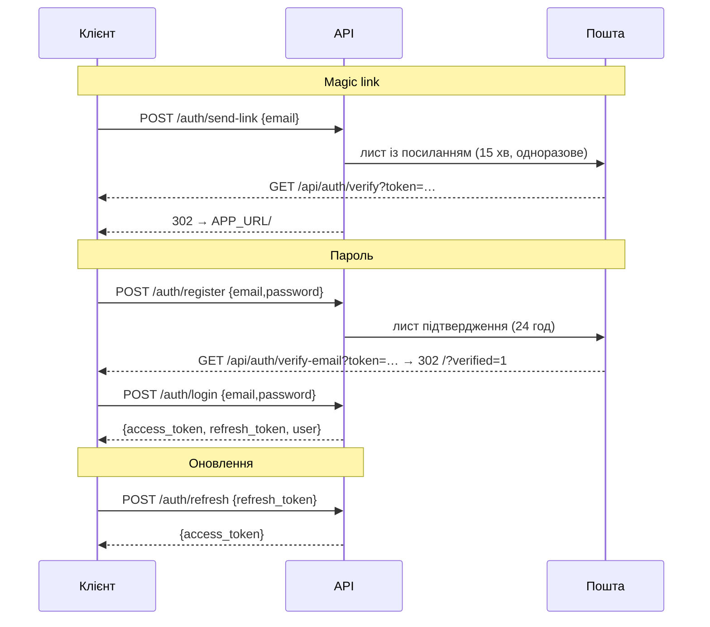

<div align="center">

# JS PROMPT — REST API

**Довідник API сервера `jsprompt-api`: автентифікація, промти, планувальник, ключі провайдерів, push-сповіщення, адміністрування, резервні копії, розсилки**


*Версія документа 1.0 · 03.10.2026 · JS PROMPT 2.0.0 · джерело істини — `api/server.js`*

</div>

---

## Зміст

1. [Загальні відомості](#1--загальні-відомості)
2. [Автентифікація](#2--автентифікація)
3. [Обмеження частоти запитів](#3--обмеження-частоти-запитів)
4. [Помилки](#4--помилки)
5. [Зведена таблиця маршрутів](#5--зведена-таблиця-маршрутів)
6. [Auth — вхід і акаунт](#6--auth--вхід-і-акаунт)
7. [Sources — вихідні тексти](#7--sources--вихідні-тексти)
8. [Prompts — промти](#8--prompts--промти)
9. [Stats — статистика користувача](#9--stats--статистика-користувача)
10. [Jobs — заплановані завдання](#10--jobs--заплановані-завдання)
11. [Push — Web Push](#11--push--web-push)
12. [Client config і проксі DeepSeek](#12--client-config-і-проксі-deepseek)
13. [User keys — ключі провайдерів](#13--user-keys--ключі-провайдерів)
14. [Custom providers](#14--custom-providers)
15. [Admin — AI-провайдери](#15--admin--ai-провайдери)
16. [Admin — користувачі](#16--admin--користувачі)
17. [Admin — промти](#17--admin--промти)
18. [Admin — статистика й очищення](#18--admin--статистика-й-очищення)
19. [Admin — резервні копії](#19--admin--резервні-копії)
20. [Admin — розсилки про оновлення](#20--admin--розсилки-про-оновлення)
21. [Health](#21--health)
22. [Планувальник (не HTTP)](#22--планувальник-не-http)
23. [Приклади](#23--приклади)

---

## 1 · Загальні відомості

| Параметр | Значення |
|---|---|
| Базова адреса | `https://promt.pp.ua/api` (nginx → `127.0.0.1:3100`) |
| Формат | JSON (`Content-Type: application/json`), тіло ≤ 2 МБ (`express.json`), nginx ≤ 4 МБ |
| Виняток | `POST /api/admin/backup/upload-restore` — сирий `application/gzip`, ≤ 500 МБ |
| CORS | лише `APP_URL`, `credentials: true`, методи `GET POST PUT PATCH DELETE OPTIONS` |
| Заголовки безпеки | `helmet` (CSP — у nginx) |
| Таймаути nginx | `/api/` — 180 с; `/api/admin/backup/` — 600 с |
| Кешування | усі відповіді API — `Cache-Control: no-store` |
| Ідентифікатори | UUID (`gen_random_uuid()`, `pgcrypto`) |
| Дати | ISO 8601 / `timestamptz` |
| М'яке видалення | `source_texts`, `prompts` — прапорець `is_deleted`, записи не зникають фізично |

Позначки в таблицях: 🔓 — без автентифікації · 🔑 — `requireAuth` · 🛡️ — `requireAuth` + `requireAdmin`.

---

## 2 · Автентифікація

### 2.1 Токени

| Токен | Строк | Підпис | Зберігання на сервері | Вміст |
|---|---|---|---|---|
| **access** (JWT) | 2 год | `JWT_SECRET` | — | `sub` (id), `email`, `role` |
| **refresh** (випадковий рядок) | 30 днів | — | `sessions.token_hash` = SHA-256 | — |

Захищені маршрути вимагають заголовок:

```http
Authorization: Bearer <access_token>
```

`requireAuth` на **кожен** запит перевіряє в БД, що користувач існує й активний (`is_active`), тому вимкнення
акаунта адміністратором діє одразу, без очікування закінчення токена. Роль для `requireAdmin` береться з БД,
а не з токена.

### 2.2 Способи входу



Токени magic link передаються у **фрагменті** URL (`#…`) — він не потрапляє в журнали сервера.

### 2.3 Одноразові токени

| Призначення | Таблиця | Строк дії |
|---|---|---|
| Magic link | `auth_tokens` | 15 хв |
| Підтвердження e-mail | `auth_tokens` | 24 год |
| Скидання пароля | `auth_tokens` | 1 год |

У БД зберігається лише SHA-256 токена; після використання ставиться `used_at`.

---

## 3 · Обмеження частоти запитів

`express-rate-limit` 7, ключ — IP клієнта (`trust proxy = 1`, IP з `X-Forwarded-For` від nginx). Відповіді містять
стандартні заголовки `RateLimit-*`; при перевищенні — **429**.

| Обмежувач | Застосування | Ліміт | Тіло 429 |
|---|---|---|---|
| `apiLimiter` | усі `/api/*` | 120 / хв / IP | `{"error":"Rate limit exceeded."}` |
| `authLimiter` | усі `/api/auth/*` | 30 / 15 хв / IP | `{"error":"Too many auth requests. Try again in 15 minutes."}` |
| `deepseekLimiter` | `POST /api/deepseek/chat` | 20 / хв / **користувач** | `{"error":{"message":"Rate limit exceeded."}}` |

`authLimiter` підключено один раз — для всього `/api/auth/*`, тож кожен запит рахується одноразово.

---

## 4 · Помилки

Єдиний формат:

```json
{ "error": "Опис помилки" }
```

Винятки: `POST /api/deepseek/chat` повертає помилки у форматі OpenAI — `{"error":{"message":"…"}}`;
`GET /api/auth/verify-email` повертає звичайний текст (це посилання з листа, відкривається в браузері).

| Код | Коли |
|---|---|
| `400` | відсутні або невалідні поля; немає рядка підтвердження для небезпечних дій |
| `401` | немає/прострочений токен (`Unauthorized`, `Invalid or expired token`), невірний пароль |
| `403` | не адміністратор (`Forbidden`); акаунт вимкнено; e-mail не підтверджено |
| `404` | запис не знайдено або належить іншому користувачу |
| `409` | e-mail уже зареєстровано; триває інша розсилка |
| `413` | завантажений бекап > 500 МБ |
| `429` | ліміт частоти |
| `500` | внутрішня помилка — деталі лише в журналі (`Internal server error` / `Server error`) |
| `502` | помилка зовнішнього сервісу (DeepSeek, SMTP) |
| `503` | сервіс не налаштовано: push без VAPID, DeepSeek без ключа, недоступна тека бекапів, БД недоступна |

Усі асинхронні обробники загорнуті в `wrapAsync`: необроблений виняток не «підвішує» запит, а потрапляє в
загальний обробник помилок.

---

## 5 · Зведена таблиця маршрутів

| Метод | Шлях | Доступ | Призначення |
|---|---|---|---|
| POST | `/api/auth/send-link` | 🔓 | надіслати magic link |
| GET | `/api/auth/verify` | 🔓 | вхід за magic link (302) |
| POST | `/api/auth/refresh` | 🔓 | новий access-токен |
| POST | `/api/auth/logout` | 🔑 | завершити сесію |
| GET | `/api/auth/me` | 🔑 | профіль |
| POST | `/api/auth/register` | 🔓 | реєстрація з паролем |
| GET | `/api/auth/verify-email` | 🔓 | підтвердження e-mail (302) |
| POST | `/api/auth/login` | 🔓 | вхід з паролем |
| POST | `/api/auth/change-password` | 🔑 | зміна пароля |
| POST | `/api/auth/forgot-password` | 🔓 | лист для скидання пароля |
| POST | `/api/auth/reset-password` | 🔓 | новий пароль за токеном |
| POST · GET | `/api/sources` | 🔑 | зберегти / список вихідних текстів |
| DELETE | `/api/sources/:id` | 🔑 | видалити (м'яко) |
| POST · GET | `/api/prompts` | 🔑 | зберегти / список промтів |
| GET · PUT · DELETE | `/api/prompts/:id` | 🔑 | читати / змінити / видалити (м'яко) |
| GET | `/api/stats` | 🔑 | статистика користувача |
| POST · GET | `/api/jobs` | 🔑 | створити / список завдань |
| GET | `/api/jobs/:id/results` | 🔑 | результати виконань |
| DELETE | `/api/jobs/:id` | 🔑 | скасувати |
| DELETE | `/api/jobs/:id/permanent` | 🔑 | видалити назавжди |
| GET | `/api/push/vapid-public-key` | 🔓 | публічний VAPID-ключ |
| POST | `/api/push/subscribe` · `/unsubscribe` | 🔑 | підписка на push |
| GET | `/api/env` | 🔑 | конфігурація клієнта |
| POST | `/api/deepseek/chat` | 🔑 | проксі DeepSeek із ключем платформи |
| GET | `/api/deepseek/balance` | 🔑 | баланс ключа платформи |
| POST · GET | `/api/user-keys` | 🔑 | зберегти / наявність ключів |
| GET | `/api/user-keys/all` | 🔑 | експорт усіх ключів |
| POST | `/api/user-keys/import` | 🔑 | імпорт ключів |
| DELETE | `/api/user-keys/:provider` | 🔑 | видалити ключ |
| GET · POST | `/api/custom-providers` | 🔑 | власні провайдери |
| DELETE | `/api/custom-providers/:key` | 🔑 | видалити провайдера й ключ |
| GET · POST | `/api/admin/provider-endpoints` | 🛡️ | довідник AI-провайдерів |
| DELETE | `/api/admin/provider-endpoints/:key` | 🛡️ | видалити провайдера |
| GET | `/api/admin/provider-endpoints/export` | 🛡️ | експорт |
| POST | `/api/admin/provider-endpoints/import` | 🛡️ | імпорт |
| GET · POST | `/api/admin/users` | 🛡️ | список / створити користувача |
| PATCH · DELETE | `/api/admin/users/:id` | 🛡️ | змінити / видалити |
| GET | `/api/admin/users/:id/keys` | 🛡️ | ключі користувача (замасковані) |
| PUT · DELETE | `/api/admin/users/:id/keys/:provider` | 🛡️ | встановити / видалити ключ |
| GET | `/api/admin/prompts` | 🛡️ | усі промти |
| GET · PUT · DELETE | `/api/admin/prompts/:id` | 🛡️ | читати / змінити / видалити |
| POST | `/api/admin/prompts/:id/copy` | 🛡️ | копіювати промт |
| GET | `/api/admin/stats` | 🛡️ | статистика платформи |
| POST | `/api/admin/wipe-database` | 🛡️ | видалити всіх, крім себе |
| POST | `/api/admin/backup/create` | 🛡️ | створити бекап |
| GET | `/api/admin/backup/list` | 🛡️ | список бекапів |
| GET | `/api/admin/backup/download/:filename` | 🛡️ | завантажити |
| DELETE | `/api/admin/backup/:filename` | 🛡️ | видалити |
| POST | `/api/admin/backup/restore/:filename` | 🛡️ | відновити з сервера |
| POST | `/api/admin/backup/upload-restore` | 🛡️ | завантажити й відновити |
| GET | `/api/admin/announcements/recipients` | 🛡️ | кількість отримувачів |
| GET | `/api/admin/announcements/status` | 🛡️ | стан останньої розсилки |
| POST | `/api/admin/announcements/send` | 🛡️ | тест / розсилка всім |
| GET | `/api/health` | 🔓 | стан сервісу |

---

## 6 · Auth — вхід і акаунт

### `POST /api/auth/send-link` 🔓

Створює користувача, якщо його ще немає, і надсилає magic link.

```json
{ "email": "user@example.com" }
```

**200** `{"message":"If an account exists, a sign-in link has been sent."}` — однакова відповідь незалежно від
існування акаунта. **400** невалідний e-mail · **403** `Account disabled`.

### `GET /api/auth/verify?token=…` 🔓

Перевіряє одноразовий токен, створює сесію, пише подію `login`.
**302** → `APP_URL/#auth_success&access=<JWT>&refresh=<refresh>`.
**400** `Invalid link` / `Link already used` / `Link expired` · **403** `Account disabled`.

### `POST /api/auth/refresh` 🔓

```json
{ "refresh_token": "…" }
```

**200** `{"access_token":"…"}` · **400** без токена · **401** `Invalid or expired session`.

### `POST /api/auth/logout` 🔑

```json
{ "refresh_token": "…" }
```

Видаляє сесію. **200** `{"message":"Logged out"}`.

### `GET /api/auth/me` 🔑

**200**
```json
{ "id": "uuid", "email": "user@example.com", "display_name": "Ім'я", "role": "user",
  "created_at": "…", "last_login_at": "…", "login_count": 12 }
```

### `POST /api/auth/register` 🔓

```json
{ "email": "user@example.com", "password": "мін. 8 символів", "display_name": "Ім'я" }
```

**201** `{"message":"Registration successful. Please check your email to verify your account."}` — надіслано
лист підтвердження (24 год). **400** немає полів / невалідний e-mail / пароль < 8 · **409** `Email already registered`.

### `GET /api/auth/verify-email?token=…` 🔓

**302** → `APP_URL/?verified=1`. Помилки — **400** простим текстом (`Invalid or expired link`, `Link already used`,
`Link expired`).

### `POST /api/auth/login` 🔓

```json
{ "email": "user@example.com", "password": "…" }
```

**200**
```json
{ "access_token": "…", "refresh_token": "…",
  "user": { "id": "uuid", "email": "user@example.com", "role": "user" } }
```

**401** `Invalid email or password` (також якщо пароль не встановлено — акаунт лише з magic link) ·
**403** `Account disabled` або `Please verify your email before logging in. Check your inbox.`

### `POST /api/auth/change-password` 🔑

```json
{ "current_password": "…", "new_password": "мін. 8 символів" }
```

**200** `{"ok":true}` · **400** `No password set` / короткий пароль · **401** `Current password is incorrect`.

### `POST /api/auth/forgot-password` 🔓

```json
{ "email": "user@example.com" }
```

**200** `{"ok":true}` завжди (не розкриває існування акаунта). Лист містить
`APP_URL/#reset_password&token=…` (1 год).

### `POST /api/auth/reset-password` 🔓

```json
{ "token": "…", "new_password": "мін. 8 символів" }
```

**200** `{"ok":true}` · **400** `Invalid or expired link` / `This link has already been used` / `This link has expired`.

---

## 7 · Sources — вихідні тексти

### `POST /api/sources` 🔑

```json
{ "original_text": "обов'язково", "translated_text": "…", "detected_lang": "uk", "domain": "general" }
```

**201** — створений рядок `source_texts`. **400** `original_text required`.

### `GET /api/sources` 🔑

| Параметр | Опис |
|---|---|
| `domain` | фільтр за доменом |
| `q` | пошук у тексті |
| `limit` | типово 50, максимум 200 |
| `offset` | зсув |

**200** — масив записів, новіші першими. Видалені не повертаються.

### `DELETE /api/sources/:id` 🔑

М'яке видалення. **200** `{"message":"Deleted"}`.

---

## 8 · Prompts — промти

### `POST /api/prompts` 🔑

```json
{
  "content": "обов'язково — текст промту",
  "title": "Назва",
  "source_text_id": "uuid | null",
  "domain": "general",
  "style": "…",
  "output_lang": "uk",
  "engine": "local | deepseek | claude | gemini",
  "token_count": 512,
  "word_count": 380,
  "quality_score": 87
}
```

**201** — створений промт; також пишеться подія в `usage_events`. **400** `content required`.

### `GET /api/prompts` 🔑

Параметри `domain`, `q`, `limit` (≤ 200, типово 50), `offset`. **200** — масив без повного тексту: метадані
(`id`, `title`, `domain`, `style`, `output_lang`, `engine`, `token_count`, …) і `content_preview`.

### `GET /api/prompts/:id` 🔑

**200** — повний промт + `source_original_text`. **404** якщо не ваш або видалений.

### `PUT /api/prompts/:id` 🔑

```json
{ "title": "Нова назва", "content": "Новий текст" }
```

**200** — оновлений промт · **404**.

### `DELETE /api/prompts/:id` 🔑

М'яке видалення. **200** `{"message":"Deleted"}`.

---

## 9 · Stats — статистика користувача

### `GET /api/stats` 🔑

**200**
```json
{
  "totals":    { "total_prompts": "42", "…": "…" },
  "by_domain": [ { "domain": "dev", "prompt_count": 10, "total_tokens": 5120, "last_created_at": "…" } ],
  "activity":  [ { "day": "2026-10-01", "count": "3" } ],
  "by_engine": [ { "engine": "deepseek", "count": "30" } ]
}
```

Лічильники `COUNT(*)` PostgreSQL повертає як рядки (`bigint`).

---

## 10 · Jobs — заплановані завдання

Завдання виконує окремий сервіс `jsprompt-scheduler` (розділ 22).

### `POST /api/jobs` 🔑

```json
{
  "prompt_id": "uuid — обов'язково",
  "next_run_at": "2026-10-04T09:00:00Z — обов'язково",
  "target_ai": "gemini",
  "schedule_type": "once | weekly | monthly | custom",
  "run_days": [1, 3, 5],
  "run_dates": [1, 15],
  "run_time": "09:00",
  "timezone": "Europe/Kyiv",
  "max_runs": 10,
  "max_tokens": 8000
}
```

| Поле | Типово | Опис |
|---|---|---|
| `target_ai` | `gemini` | ключ провайдера (`gemini`, `claude`, `deepseek` або будь-який із довідника провайдерів) |
| `schedule_type` | `once` | тип розкладу |
| `run_days` | `null` | дні тижня для `weekly` |
| `run_dates` | `null` | числа місяця для `monthly` |
| `timezone` | `UTC` | часовий пояс для `run_time` |
| `max_runs` | `null` | ліміт виконань (без ліміту, якщо `null`) |
| `max_tokens` | `null` | бюджет відповіді; планувальник враховує «мислення» моделей і продовжує обірвану відповідь |

**201** — створене завдання · **400** без `prompt_id`/`next_run_at` · **404** `Prompt not found`.

### `GET /api/jobs` 🔑

**200** — масив завдань користувача з `prompt_title` і `domain`.

### `GET /api/jobs/:id/results?from=…&to=…` 🔑

**200** — до 100 останніх результатів (`job_results`), новіші першими; `from`/`to` — межі `ran_at`.

### `DELETE /api/jobs/:id` 🔑

Скасовує (статус `cancelled`, історія лишається). **200** `{"message":"Job cancelled"}`.

### `DELETE /api/jobs/:id/permanent` 🔑

Видаляє завдання разом із результатами. **204**.

---

## 11 · Push — Web Push

### `GET /api/push/vapid-public-key` 🔓

**200** `{"key":"B…"}` · **503** `Push not configured` (немає `VAPID_*` у `.env`).

### `POST /api/push/subscribe` 🔑

Тіло — `PushSubscription.toJSON()` браузера плюс мова сповіщень:

```json
{ "endpoint": "https://fcm.googleapis.com/…", "keys": { "p256dh": "…", "auth": "…" }, "lang": "uk" }
```

**201** `{"ok":true}` (upsert за `endpoint`) · **400** `Invalid subscription`.

### `POST /api/push/unsubscribe` 🔑

```json
{ "endpoint": "https://…" }
```

**200** `{"ok":true}`.

---

## 12 · Client config і проксі DeepSeek

### `GET /api/env` 🔑

**200** `{"deepseekConfigured":true,"APP_URL":"https://promt.pp.ua"}` — сам ключ ніколи не повертається.

### `POST /api/deepseek/chat` 🔑 · 20 запитів / хв на користувача

Генерація промтів ключем **платформи** (`DEEPSEEK_API_KEY`), коли в користувача немає власного ключа.

```json
{
  "messages": [
    { "role": "system", "content": "…" },
    { "role": "user", "content": "…" }
  ],
  "temperature": 0.2,
  "max_tokens": 2000
}
```

| Правило | Значення |
|---|---|
| `messages` | 1–20 елементів, `role` ∈ `system`/`user`/`assistant`, `content` — рядок; інші поля відкидаються |
| `temperature` | обрізається до 0–2, типово 0.2 |
| `max_tokens` | обрізається до 1–4000, типово 2000 |
| `model` | завжди `deepseek-chat` (клієнт не може змінити) |

**Відповідь** — тіло DeepSeek Chat Completions без змін (`choices[0].message.content`, `usage`, …) з тим самим
статусом, **крім 401 → 502** (щоб клієнт не вважав це помилкою власного ключа).
**400** `Invalid messages` · **502** `DeepSeek API unreachable` · **503** `DeepSeek key not configured`.

### `GET /api/deepseek/balance` 🔑

**200** — відповідь DeepSeek `/user/balance` для ключа платформи · **503** · **502**.

---

## 13 · User keys — ключі провайдерів

Особисті ключі зберігаються в `user_provider_keys` і використовуються планувальником та клієнтом.

### `POST /api/user-keys` 🔑

```json
{ "deepseek_key": "sk-…", "claude_key": "sk-ant-…", "gemini_key": "AIza…" }
```

Непорожні поля зберігаються (upsert); порожні або відсутні пропускаються — для видалення є `DELETE /api/user-keys/:provider`. **200** `{"ok":true}`.

### `GET /api/user-keys` 🔑

**200** `{"deepseek":true,"claude":false,"gemini":true}` — лише ознаки наявності.

### `GET /api/user-keys/all` 🔑

> [!WARNING]
> Повертає **справжні значення** ключів власника (для експорту в файл). Не логуйте відповідь.

**200**
```json
{ "providers": { "claude": { "label": "Claude", "key": "sk-ant-…", "prefix": "sk-ant-", "builtin": true } },
  "exportedAt": "2026-10-03T12:00:00.000Z" }
```

### `POST /api/user-keys/import` 🔑

Тіло — формат експорту (поле `providers`). **200** `{"ok":true,"imported":3}` · **400** `providers object required`.

### `DELETE /api/user-keys/:provider` 🔑

**204**.

---

## 14 · Custom providers

Власні (не вбудовані) провайдери користувача — назва й префікс ключа.

| Маршрут | Тіло / відповідь |
|---|---|
| `GET /api/custom-providers` 🔑 | **200** `{"providers":[{"provider_key","label","key_prefix",…}]}` |
| `POST /api/custom-providers` 🔑 | `{"provider_key":"groq","label":"Groq","prefix":"gsk_"}` → **201** `{"ok":true}` · **400** без `provider_key`/`label` |
| `DELETE /api/custom-providers/:key` 🔑 | видаляє провайдера **і** його ключ → **204** |

---

## 15 · Admin — AI-провайдери

Довідник `ai_provider_endpoints`: як викликати кожного провайдера (URL, модель, заголовок автентифікації, опції).
Його використовує планувальник для `target_ai`. Ключів довідник **не містить**. Готовий набір для імпорту —
`deploy/ai-providers.json`.

### `GET /api/admin/provider-endpoints` 🛡️

**200** `{"providers":[{ "provider_key", "label", "endpoint_url", "model_name", "auth_header", "auth_prefix", "is_active", "is_builtin", "provider_options", … }]}`

### `POST /api/admin/provider-endpoints` 🛡️

Створює або оновлює (upsert за `provider_key`; незаповнені поля не затирають наявні).

```json
{
  "provider_key": "claude",
  "label": "Claude (Anthropic)",
  "endpoint_url": "https://api.anthropic.com/v1/messages",
  "model_name": "claude-sonnet-4-6",
  "auth_header": "x-api-key",
  "auth_prefix": "",
  "is_active": true,
  "is_builtin": true,
  "provider_options": { "tools": [ { "type": "web_search_20260209", "name": "web_search" } ] }
}
```

**201** `{"ok":true}` · **400** без `provider_key`, `label`, `endpoint_url`, `model_name`.

Для Gemini URL будує сам планувальник з `model_name` (`…/v1beta/models/<model>:generateContent`);
для решти провайдерів `endpoint_url` використовується як є.

### `DELETE /api/admin/provider-endpoints/:key` 🛡️ → **204**

### `GET /api/admin/provider-endpoints/export` 🛡️

**200** `{"providers":[…усі поля…],"exportedAt":"…"}`.

### `POST /api/admin/provider-endpoints/import` 🛡️

```json
{ "providers": [ { "provider_key": "…", "label": "…", "endpoint_url": "…", "model_name": "…" } ] }
```

**200** `{"ok":true,"imported":10}` · **400** `providers array required`.

---

## 16 · Admin — користувачі

### `GET /api/admin/users` 🛡️

**200** — масив користувачів (`id`, `email`, `display_name`, `role`, `is_active`, дати, лічильники). Хеш пароля
не повертається.

### `POST /api/admin/users` 🛡️

```json
{ "email": "new@example.com", "password": "мін. 8", "display_name": "Ім'я", "role": "user | admin" }
```

Створює вже підтвердженого й активного користувача. **201** `{"id","email","role","display_name"}` ·
**400** · **409** `Email already registered`.

### `PATCH /api/admin/users/:id` 🛡️

```json
{ "is_active": false, "role": "admin", "display_name": "Нове ім'я" }
```

Усі поля необов'язкові; `role` нормалізується до `admin`/`user`.
**200** `{"id","email","display_name","role","is_active","email_verified","created_at","last_login_at","login_count"}` · **404**.

### `DELETE /api/admin/users/:id` 🛡️

Видаляє користувача з усіма даними (`ON DELETE CASCADE`). **204** · **400** `Cannot delete your own account`.

### Ключі користувача

| Маршрут | Опис |
|---|---|
| `GET /api/admin/users/:id/keys` 🛡️ | **200** `{"keys":[{"provider","label","key_prefix","is_builtin","updated_at"}]}` — **без** значень ключів |
| `PUT /api/admin/users/:id/keys/:provider` 🛡️ | `{"api_key":"…","label":"…"}` → **200** `{"ok":true}` · **400** `api_key required` |
| `DELETE /api/admin/users/:id/keys/:provider` 🛡️ | **204** |

---

## 17 · Admin — промти

| Маршрут | Тіло / параметри | Відповідь |
|---|---|---|
| `GET /api/admin/prompts` 🛡️ | `q`, `user_id`, `limit` (≤ 300, типово 100), `offset` | масив промтів усіх користувачів (з e-mail автора) |
| `GET /api/admin/prompts/:id` 🛡️ | — | промт + `user_email` + `source_original_text` · **404** |
| `PUT /api/admin/prompts/:id` 🛡️ | `{"title","content","domain","user_email"}` — `user_email` передає промт іншому власнику | оновлений промт · **400** `No user found with that email` · **404** |
| `DELETE /api/admin/prompts/:id` 🛡️ | — | **204** |
| `POST /api/admin/prompts/:id/copy` 🛡️ | `{"title","domain","user_email"}` (усі необов'язкові) | **201** — нова копія · **400** · **404** |

---

## 18 · Admin — статистика й очищення

### `GET /api/admin/stats` 🛡️

**200**
```json
{
  "users":   { "total": "57", "active": "55" },
  "prompts": { "total": "910", "active": "874" },
  "events":  [ { "event_type": "login", "count": "1200" } ],
  "jobs":    [ { "status": "active", "count": "14" } ]
}
```

### `POST /api/admin/wipe-database` 🛡️

> [!CAUTION]
> Безповоротно видаляє **всіх інших** користувачів і всі їхні дані. Акаунт адміністратора, що виконує запит,
> зберігається. Спершу зробіть бекап.

```json
{ "confirm": "WIPE_EVERYTHING" }
```

**200** `{"ok":true,"message":"All other accounts and their data wiped. Your admin account was preserved."}` ·
**400** без підтвердження.

---

## 19 · Admin — резервні копії

Усі маршрути проходять `requireBackupDir`: якщо `BACKUP_DIR` відсутня, недоступна для запису або лежить у
веб-корені — **503** з поясненням, що виправити.

Ім'я файлу має відповідати
`^(jsprompt|uploaded)_YYYY-MM-DD_HH-MM-SS\.sql\.gz$`, інакше **400** `Invalid filename` (захист від обходу шляхів).

### `POST /api/admin/backup/create` 🛡️

`pg_dump` (plain SQL, `--no-owner --no-privileges --clean --if-exists`, без команд розширень) → `gzip`.
**201** `{"ok":true,"filename":"jsprompt_2026-10-03_12-00-00.sql.gz","size":182344,"created_at":"…"}` ·
**500** `Backup failed: …`.

### `GET /api/admin/backup/list` 🛡️

**200** `[{"filename","size","created_at"}]`, новіші першими.

### `GET /api/admin/backup/download/:filename` 🛡️

Файл як вкладення (`Content-Disposition: attachment`). **404**.

### `DELETE /api/admin/backup/:filename` 🛡️ → **204** · **404**

### `POST /api/admin/backup/restore/:filename` 🛡️

```json
{ "confirm": "RESTORE_DATABASE" }
```

**200** `{"ok":true,"message":"Database restored from <file>."}` · **400** · **404** `Backup not found` · **500** `Restore failed: …`.

### `POST /api/admin/backup/upload-restore?confirm=RESTORE_DATABASE` 🛡️

Тіло — сирий файл `.sql.gz`, `Content-Type: application/gzip`, ≤ 500 МБ (потоково на диск як
`uploaded_<час>.sql.gz`).
**200** `{"ok":true,"message":"…","filename":"uploaded_…sql.gz"}` · **400** · **413** `File too large (max 500 MB)` · **500**.

### Перевірки перед відновленням

1. SQL розпаковується й перевіряється: заборонені будь-які мета-команди `psql` (`\!`, `\i`, `\copy` …), окрім
   `\restrict` / `\unrestrict`, які додає сучасний `pg_dump`.
2. Заборонено `SET standard_conforming_strings = off`; також перевіряється, що на сервері він `on`.
3. Відновлення виконується `psql -v ON_ERROR_STOP=1 --single-transaction` від `jsprompt_app` — у разі помилки
   база лишається без змін.

---

## 20 · Admin — розсилки про оновлення

Розсилка йде у фоні з таблиць `announcement_campaigns` / `announcement_deliveries`: кожному отримувачу не
більше одного листа, обмежена кількість повторів при помилках SMTP, автоматичне продовження після перезапуску
API. Отримувачі — активні користувачі з підтвердженим e-mail.

### `GET /api/admin/announcements/recipients` 🛡️

**200** `{"count":55}`.

### `GET /api/admin/announcements/status` 🛡️

**200**
```json
{ "id": "uuid", "subject": "JS PROMPT 2.0.0", "total": 55, "sent": 40, "failed": 1,
  "running": true, "startedAt": "…", "finishedAt": null }
```

Якщо розсилок ще не було — `{"running":false}`.

### `POST /api/admin/announcements/send` 🛡️

```json
{
  "subject": "≤ 200 символів",
  "html": "≤ 200 КБ",
  "text": "≤ 100 КБ — текстова версія",
  "mode": "test | all",
  "confirm": "SEND_TO_ALL"
}
```

| `mode` | Поведінка | Відповідь |
|---|---|---|
| `test` (типово) | лист лише адміністратору, що надсилає | **200** `{"ok":true,"mode":"test","sentTo":"admin@…"}` · **502** помилка SMTP |
| `all` | потрібне `confirm: "SEND_TO_ALL"`; кампанія стартує у фоні | **202** — об'єкт стану (як у `/status`) · **409** якщо інша розсилка триває |

**400** — невалідні поля або немає підтвердження.

---

## 21 · Health

### `GET /api/health` 🔓

**200** `{"status":"ok","db":"ok","ts":"2026-10-03T12:00:00.000Z"}` · **503** `{"status":"error","db":"error"}`.

Підходить для моніторингу (UptimeRobot, healthchecks): не потребує токена, виконує `SELECT 1`.

---

## 22 · Планувальник (не HTTP)

`api/scheduler.js` — окремий процес без HTTP-інтерфейсу. Кожні `SCHEDULER_INTERVAL_MS` (60 с):

1. Вибирає активні завдання з `next_run_at ≤ now()`.
2. Визначає ключ: особистий ключ користувача для `target_ai`, інакше ключ платформи (`GEMINI_API_KEY`,
   `CLAUDE_API_KEY`, `DEEPSEEK_API_KEY`).
3. Викликає провайдера за довідником `ai_provider_endpoints` (вбудовані адаптери для Gemini, Claude, DeepSeek;
   OpenAI-сумісний формат для решти). Бюджет токенів враховує «мислення» моделей; обірвана відповідь
   (`max_tokens`) продовжується автоматично.
4. Записує результат у `job_results`, рахує наступний запуск за `schedule_type`, `timezone`, `max_runs`.
5. При перевантаженні провайдера (429/503, для Claude також 529) повторює спершу в межах процесу, потім через 30 хв (`retry_count`, обмежено).
6. Надсилає push-сповіщення на підписані пристрої користувача.

Результати клієнт читає через `GET /api/jobs/:id/results`.

---

## 23 · Приклади

```bash
API=https://promt.pp.ua/api

# Вхід паролем → access-токен у змінну (jq)
ACCESS=$(curl -s -X POST $API/auth/login -H 'Content-Type: application/json' \
  -d '{"email":"user@example.com","password":"…"}' | jq -r .access_token)

# Профіль
curl -s $API/auth/me -H "Authorization: Bearer $ACCESS"

# Зберегти промт
curl -s -X POST $API/prompts -H "Authorization: Bearer $ACCESS" -H 'Content-Type: application/json' \
  -d '{"title":"Код-рев'"'"'ю","content":"<role>…</role>","domain":"dev","engine":"local"}'

# Запланувати щотижневе виконання в Gemini
curl -s -X POST $API/jobs -H "Authorization: Bearer $ACCESS" -H 'Content-Type: application/json' \
  -d '{"prompt_id":"<uuid>","next_run_at":"2026-10-05T07:00:00Z","target_ai":"gemini",
       "schedule_type":"weekly","run_days":[1],"run_time":"10:00","timezone":"Europe/Kyiv"}'

# Адмін: створити бекап і переглянути список
curl -s -X POST $API/admin/backup/create -H "Authorization: Bearer $ACCESS"
curl -s $API/admin/backup/list -H "Authorization: Bearer $ACCESS"

# Адмін: завантажити й відновити бекап
curl -s -X POST "$API/admin/backup/upload-restore?confirm=RESTORE_DATABASE" \
  -H "Authorization: Bearer $ACCESS" -H 'Content-Type: application/gzip' \
  --data-binary @jsprompt_2026-10-03_12-00-00.sql.gz
```

JavaScript (браузер):

```js
async function api(path, { method = 'GET', body, token } = {}) {
  const res = await fetch(`/api${path}`, {
    method,
    headers: { 'Content-Type': 'application/json', ...(token && { Authorization: `Bearer ${token}` }) },
    body: body && JSON.stringify(body),
  });
  if (res.status === 204) return null;
  const data = await res.json().catch(() => ({}));
  if (!res.ok) throw new Error(data.error?.message || data.error || res.statusText);
  return data;
}
// При 401 — один раз оновити access-токен через /auth/refresh і повторити запит.
```

---

<div align="center"><sub>promt.pp.ua · JS PROMPT 2.0.0 · довідник REST API</sub></div>
