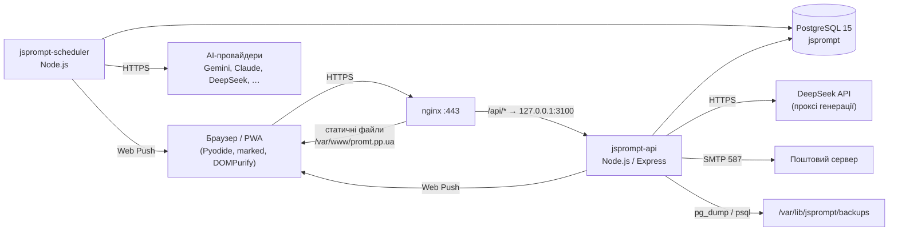

<div align="center">

# JS PROMPT — встановлення та налаштування

**Повне розгортання promt.pp.ua на чистому сервері: програмне забезпечення, база даних, API, планувальник, nginx, HTTPS, пошта, резервні копії**


-339933?logo=node.js&logoColor=white)


*Версія документа 1.0 · 03.10.2026 · JS PROMPT 2.0.0*

</div>

---

## Зміст

1. [Архітектура](#1--архітектура)
2. [Вимоги до сервера](#2--вимоги-до-сервера)
3. [Програмне забезпечення](#3--програмне-забезпечення)
4. [Встановлення системних пакетів](#4--встановлення-системних-пакетів)
5. [Користувачі та код застосунку](#5--користувачі-та-код-застосунку)
6. [PostgreSQL](#6--postgresql)
7. [Файл конфігурації .env](#7--файл-конфігурації-env)
8. [Залежності Node.js](#8--залежності-nodejs)
9. [Сервіси systemd](#9--сервіси-systemd)
10. [nginx і HTTPS](#10--nginx-і-https)
11. [Пошта (SMTP)](#11--пошта-smtp)
12. [Резервні копії](#12--резервні-копії)
13. [Перше налаштування в застосунку](#13--перше-налаштування-в-застосунку)
14. [Перевірка після встановлення](#14--перевірка-після-встановлення)
15. [Оновлення застосунку](#15--оновлення-застосунку)
16. [Усунення несправностей](#16--усунення-несправностей)
17. [Контрольний список безпеки](#17--контрольний-список-безпеки)

---

## 1 · Архітектура



| Компонент | Що робить | Де |
|---|---|---|
| **Фронтенд (PWA)** | генерація промтів, конвертер PDF/DOCX, редактор, перевірка тексту; обчислення в браузері через Pyodide | `index.html`, `js/`, `css/`, `sw.js` |
| **API** | акаунти, промти, завдання, ключі, адмін-функції, проксі DeepSeek, бекапи, розсилки | `api/server.js`, порт `3100` (лише localhost) |
| **Планувальник** | раз на хвилину виконує заплановані промти через AI-провайдерів, надсилає push-сповіщення | `api/scheduler.js` |
| **PostgreSQL** | усі дані | база `jsprompt`, роль `jsprompt_app` |
| **nginx** | HTTPS, статичні файли, проксі `/api/`, блокування службових шляхів | `/etc/nginx/sites-available/promt.pp.ua.conf` |

---

## 2 · Вимоги до сервера

| Ресурс | Мінімум | Рекомендовано |
|---|---|---|
| ОС | Debian 12 (bookworm) або Ubuntu 22.04+ | Debian 12 |
| CPU / RAM | 1 vCPU / 2 ГБ | 2+ vCPU / 4 ГБ |
| Диск | 10 ГБ | 20+ ГБ (бекапи, логи) |
| Мережа | публічна IPv4, порти 80 і 443 | + 25/587, якщо пошта на цьому ж сервері |
| DNS | A-записи `promt.pp.ua` і `www.promt.pp.ua` → IP сервера | + MX/SPF/DKIM/DMARC для пошти |

---

## 3 · Програмне забезпечення

| Програма | Версія | Призначення | Обов'язково |
|---|---|---|---|
| **nginx** | 1.22+ | вебсервер, TLS, проксі API | так |
| **certbot** + `python3-certbot-nginx` | 2.x | сертифікати Let's Encrypt | так |
| **PostgreSQL** + `postgresql-contrib` | 15 | база даних (розширення `pgcrypto`, `pg_trgm`) | так |
| **postgresql-client** | **та сама мажорна версія**, що й сервер | `pg_dump` / `psql` для бекапів і відновлення | так |
| **Node.js** | ≥ 20 (на продакшні 23.11.1 з NodeSource) | API та планувальник (вбудований `fetch`) | так |
| **npm** | разом із Node.js | встановлення залежностей API | так |
| **git** | 2.30+ | отримання та оновлення коду | так |
| **gzip** | будь-яка | стиснення бекапів | так |
| **SMTP-сервер** | Mailcow (Docker) або зовнішній SMTP | листи: вхід, підтвердження, скидання пароля, розсилки | так |
| **openssl** | будь-яка | генерація секретів | так |
| **chromium** | 140+ | автоматичні скріншоти інтерфейсу | ні |
| **CodeRabbit CLI**, Claude Code | — | рев'ю коду ([CodeRabbit_ClaudeCode.md](CodeRabbit_ClaudeCode.md)) | ні |

Залежності API (`api/package.json`): `express` 4, `pg`, `jsonwebtoken`, `bcrypt`, `nodemailer`, `helmet`,
`cors`, `express-rate-limit`, `dotenv`, `web-push`. Фронтенд підтягує з CDN `pyodide` 0.25.1, `marked` 12,
`DOMPurify` 3; `JSZip` 3.10.1 лежить локально в `js/vendor/`.

---

## 4 · Встановлення системних пакетів

```bash
sudo apt update && sudo apt upgrade -y
sudo apt install -y nginx certbot python3-certbot-nginx \
     postgresql postgresql-contrib postgresql-client \
     git gzip openssl ca-certificates curl
```

**Node.js** — з офіційного репозиторію NodeSource (у стандартному Debian 12 версія застара):

```bash
curl -fsSL https://deb.nodesource.com/setup_22.x -o /tmp/nodesource_setup.sh
less /tmp/nodesource_setup.sh            # переглянути скрипт перед запуском
sudo bash /tmp/nodesource_setup.sh
sudo apt install -y nodejs
node -v && npm -v                        # очікувано: v22.x або новіша
```

> [!NOTE]
> Продакшн працює на Node.js 23.11.1 (`23.11.1-1nodesource1`). Підтримується будь-яка версія від 20 — потрібні
> вбудовані `fetch` і `WebSocket`.

Перевірте, що клієнт PostgreSQL відповідає серверу:

```bash
psql --version && sudo -u postgres psql -tAc "SHOW server_version"
```

---

## 5 · Користувачі та код застосунку

| Користувач | Роль |
|---|---|
| `promtops` | власник коду, деплой, git, CodeRabbit/Claude Code; входить до групи `www-data` |
| `www-data` | від нього працюють nginx, `jsprompt-api`, `jsprompt-scheduler` |
| `postgres` | адміністратор PostgreSQL |

```bash
sudo adduser --disabled-password --gecos "" promtops
sudo usermod -aG www-data promtops
sudo install -d -o promtops -g promtops -m 755 /var/www/promt.pp.ua
sudo -u promtops git clone git@github.com:bioluch/promt.pp.ua.git /var/www/promt.pp.ua
```

Права: теки `755`, файли `644` (nginx і сервіси лише читають код). Нічого у веб-корені не повинно бути
записуваним для `www-data`.

---

## 6 · PostgreSQL

### 6.1 Роль, база, розширення (від `postgres`)

Власником бази й схеми має бути **роль застосунку** `jsprompt_app`: API під час старту створює власні таблиці
(розсилки), а відновлення з бекапу перепризначає власника об'єктів. У PostgreSQL 15 інші ролі не мають права
створювати об'єкти в схемі `public`.

```bash
APP_PW=$(openssl rand -base64 32 | tr -d '/+=' | cut -c1-32); echo "PG_PASSWORD=$APP_PW"   # збережіть для .env
sudo -u postgres psql -v ON_ERROR_STOP=1 <<SQL
CREATE ROLE jsprompt_app LOGIN PASSWORD '$APP_PW';
CREATE DATABASE jsprompt OWNER jsprompt_app ENCODING 'UTF8'
       LC_COLLATE 'en_US.UTF-8' LC_CTYPE 'en_US.UTF-8' TEMPLATE template0;
\c jsprompt
CREATE EXTENSION IF NOT EXISTS pgcrypto;
CREATE EXTENSION IF NOT EXISTS pg_trgm;
ALTER SCHEMA public OWNER TO jsprompt_app;
SQL
```

> [!IMPORTANT]
> Розширення `pgcrypto` і `pg_trgm` встановлює лише суперкористувач — один раз. Бекапи застосунку створюються
> без команд `CREATE/DROP EXTENSION`, тому відновлення від імені `jsprompt_app` їх не чіпає.
> Якщо локаль `en_US.UTF-8` відсутня: `sudo dpkg-reconfigure locales`.

### 6.2 Схема (від `jsprompt_app`)

`db/schema.sql` містить у розділах 1–2 команди створення бази й ролей (для довідки) — їх уже виконано вище.
Імпортуйте лише розділ 3 (структура) від імені власника:

```bash
cd /var/www/promt.pp.ua
sed -n '/^-- ── 3\. SCHEMA/,/^-- ── 4\. GRANT/p' db/schema.sql | grep -v '^-- ── 4\. GRANT' \
  | PGPASSWORD="$APP_PW" psql -h 127.0.0.1 -U jsprompt_app -d jsprompt -v ON_ERROR_STOP=1
```

### 6.3 Міграції

Схема в `db/schema.sql` уже містить усі зміни з `db/migrations/`. На **наявній** базі застосовуйте міграції по
черзі (вони ідемпотентні — `IF NOT EXISTS`):

```bash
for f in db/migrations/*.sql; do
  PGPASSWORD="$APP_PW" psql -h 127.0.0.1 -U jsprompt_app -d jsprompt -v ON_ERROR_STOP=1 -f "$f"
done
```

| Міграція | Що додає |
|---|---|
| `2026-07-19_add_retry_count.sql` | `scheduled_jobs.retry_count` — ліміт повторів при перевантаженні AI |
| `2026-10-03_announcements.sql` | таблиці розсилок `announcement_campaigns`, `announcement_deliveries` (також створюються API автоматично) |

### 6.4 Налаштування сервера БД

PostgreSQL слухає лише `127.0.0.1:5432` (типово для Debian). Залиште `standard_conforming_strings = on`
(типово) — відновлення бекапу перевіряє це й відмовляє, якщо параметр вимкнено.

```bash
sudo -u postgres psql -tAc "SHOW listen_addresses; SHOW standard_conforming_strings"
```

---

## 7 · Файл конфігурації .env

Файл `/var/www/promt.pp.ua/.env` читають обидва сервіси через `EnvironmentFile` systemd (від root), тому
достатньо прав `600` для власника коду. У веб-корені він захищений nginx (dot-файли → 404) і `.gitignore`.

```bash
cd /var/www/promt.pp.ua
umask 077
cat > .env <<'EOF'
# ── Застосунок ──
APP_URL=https://promt.pp.ua
NODE_ENV=production
PORT=3100

# ── PostgreSQL ──
PG_HOST=127.0.0.1
PG_PORT=5432
PG_DB=jsprompt
PG_USER=jsprompt_app
PG_PASSWORD=<пароль із розділу 6.1>

# ── JWT (два РІЗНІ випадкові секрети) ──
JWT_SECRET=<openssl rand -hex 64>
JWT_REFRESH_SECRET=<openssl rand -hex 64>

# ── Пошта ──
MAIL_HOST=127.0.0.1
MAIL_PORT=587
MAIL_USER=noreply@promt.pp.ua
MAIL_PASS=<пароль поштової скриньки>
MAIL_FROM=JS PROMPT <noreply@promt.pp.ua>

# ── Web Push (VAPID) ──
VAPID_PUBLIC_KEY=<див. розділ 8>
VAPID_PRIVATE_KEY=<див. розділ 8>
VAPID_SUBJECT=mailto:admin@promt.pp.ua

# ── AI-ключі платформи (необов'язково; користувачі можуть мати власні) ──
DEEPSEEK_API_KEY=
GEMINI_API_KEY=
CLAUDE_API_KEY=

# ── Резервні копії (поза веб-коренем!) ──
BACKUP_DIR=/var/lib/jsprompt/backups
EOF
chmod 600 .env
```

### 7.1 Довідник змінних

| Змінна | Типово | Обов'язкова | Опис |
|---|---|---|---|
| `APP_URL` | `https://promt.pp.ua` | так | публічна адреса; посилання в листах, CORS |
| `NODE_ENV` | `production` | — | режим Node.js |
| `PORT` | `3100` | — | порт API (слухає лише `127.0.0.1`) |
| `PG_HOST` / `PG_PORT` / `PG_DB` / `PG_USER` | `127.0.0.1` / `5432` / `jsprompt` / `jsprompt_app` | — | підключення до БД |
| `PG_PASSWORD` | — | **так** | пароль `jsprompt_app`; без нього API не стартує |
| `JWT_SECRET` | — | **так** | підпис access-токенів (2 год) |
| `JWT_REFRESH_SECRET` | — | **так** | підпис refresh-токенів |
| `MAIL_HOST` / `MAIL_PORT` | `127.0.0.1` / `587` | — | SMTP; `465` → TLS одразу |
| `MAIL_USER` / `MAIL_PASS` | — | для пошти | обліковий запис SMTP |
| `MAIL_FROM` | `noreply@promt.pp.ua` | — | відправник |
| `VAPID_PUBLIC_KEY` / `VAPID_PRIVATE_KEY` | — | для push | ключі Web Push; без них push вимкнено |
| `VAPID_SUBJECT` | `mailto:admin@promt.pp.ua` | — | контакт для push-сервісів |
| `DEEPSEEK_API_KEY` | — | ні | ключ платформи для генерації промтів (через проксі, у браузер не передається) і планувальника |
| `GEMINI_API_KEY` | — | ні | ключ платформи Gemini для планувальника |
| `CLAUDE_API_KEY` | — | ні | ключ платформи Claude для планувальника |
| `BACKUP_DIR` | `/var/lib/jsprompt/backups` | — | тека бекапів; **має бути поза веб-коренем** |
| `SCHEDULER_INTERVAL_MS` | `60000` | — | період опитування планувальника |
| `MAIL_TLS_INSECURE` | — | ні | лише для `mail/test-smtp.js`: `1` дозволяє самопідписаний сертифікат |

> [!CAUTION]
> Ніколи не комітьте `.env` і не надсилайте його вміст у чати чи рев'ю. Якщо ключ міг потрапити до сторонніх —
> відкличте його в консолі провайдера й замініть.

---

## 8 · Залежності Node.js

```bash
cd /var/www/promt.pp.ua/api
npm ci --omit=dev               # точні версії з package-lock.json
npx web-push generate-vapid-keys   # скопіюйте Public/Private Key у .env (розділ 7)
node --check server.js scheduler.js
```

---

## 9 · Сервіси systemd

### 9.1 API — `/etc/systemd/system/jsprompt-api.service`

```ini
[Unit]
Description=JS PROMPT v2 — API Server
After=network.target postgresql.service
Wants=postgresql.service
StartLimitIntervalSec=60
StartLimitBurst=5

[Service]
Type=simple
User=www-data
Group=www-data
WorkingDirectory=/var/www/promt.pp.ua/api
ExecStart=/usr/bin/node /var/www/promt.pp.ua/api/server.js
EnvironmentFile=/var/www/promt.pp.ua/.env
Environment=NODE_ENV=production
Restart=always
RestartSec=5
PrivateTmp=true
ProtectSystem=strict
ReadWritePaths=/var/log /tmp /var/lib/jsprompt/backups
NoNewPrivileges=true
StandardOutput=journal
StandardError=journal
SyslogIdentifier=jsprompt-api

[Install]
WantedBy=multi-user.target
```

> [!IMPORTANT]
> `ProtectSystem=strict` робить файлову систему доступною лише для читання; запис дозволено тільки в
> `ReadWritePaths`. Тека бекапів **має** бути в цьому списку, інакше «Create Backup» поверне помилку `EROFS`.
> На продакшні основний юніт ще містить старий шлях `/var/www/promt.pp.ua/backups`, а нову теку додано
> окремим доповненням (drop-in):
> `/etc/systemd/system/jsprompt-api.service.d/backups.conf` з рядками `[Service]` і
> `ReadWritePaths=/var/lib/jsprompt/backups`.

### 9.2 Планувальник — `/etc/systemd/system/jsprompt-scheduler.service`

```ini
[Unit]
Description=JS PROMPT v2 — AI Job Scheduler
After=network.target postgresql.service jsprompt-api.service
Wants=postgresql.service

[Service]
Type=simple
User=www-data
Group=www-data
WorkingDirectory=/var/www/promt.pp.ua/api
ExecStart=/usr/bin/node /var/www/promt.pp.ua/api/scheduler.js
EnvironmentFile=/var/www/promt.pp.ua/.env
Environment=NODE_ENV=production
Restart=always
RestartSec=10
PrivateTmp=true
ProtectSystem=strict
ReadWritePaths=/var/log /tmp
NoNewPrivileges=true
StandardOutput=journal
StandardError=journal
SyslogIdentifier=jsprompt-scheduler

[Install]
WantedBy=multi-user.target
```

### 9.3 Запуск

```bash
sudo install -d -o www-data -g www-data -m 750 /var/lib/jsprompt/backups   # до старту API
sudo systemctl daemon-reload
sudo systemctl enable --now jsprompt-api jsprompt-scheduler
systemctl status jsprompt-api jsprompt-scheduler --no-pager
sudo journalctl -u jsprompt-api -u jsprompt-scheduler -n 50 --no-pager
```

Очікувано в журналі: `[api] JS PROMPT v2 API running on 127.0.0.1:3100`, `[scheduler] JS PROMPT v2 Scheduler started`.

---

## 10 · nginx і HTTPS

### 10.1 Заголовки безпеки — `/etc/nginx/snippets/promt-headers.conf`

Підключається на рівні сервера **і** в кожному `location`, що має власні `add_header`
(інакше nginx їх не успадковує).

```nginx
add_header Strict-Transport-Security "max-age=63072000; includeSubDomains; preload" always;
add_header X-Content-Type-Options "nosniff" always;
add_header Referrer-Policy "strict-origin-when-cross-origin" always;
add_header Permissions-Policy "microphone=(self)" always;
add_header Content-Security-Policy "default-src 'self'; script-src 'self' 'unsafe-eval' 'unsafe-inline' https://cdn.jsdelivr.net https://esm.sh https://cdnjs.cloudflare.com https://www.googletagmanager.com; style-src 'self' 'unsafe-inline'; font-src 'self'; img-src 'self' data: https://www.googletagmanager.com https://www.google-analytics.com https://*.google-analytics.com; connect-src 'self' https://api.deepseek.com https://api.anthropic.com https://huggingface.co https://cdn.jsdelivr.net https://esm.sh https://generativelanguage.googleapis.com https://pypi.org https://files.pythonhosted.org https://www.googletagmanager.com https://www.google-analytics.com https://*.google-analytics.com https://*.analytics.google.com https://stats.g.doubleclick.net; worker-src 'self' blob:; frame-src 'self' https://www.googletagmanager.com; frame-ancestors 'self';" always;
```

`'unsafe-eval'` і `wasm`-виконання потрібні Pyodide (Python у браузері).

### 10.2 Сайт

Еталонна конфігурація — у репозиторії: [`deploy/nginx/promt.pp.ua.conf`](../deploy/nginx/promt.pp.ua.conf).
Ключові правила:

| Правило | Навіщо |
|---|---|
| `location ^~ /api/` → `proxy_pass http://127.0.0.1:3100` | `^~` не дає регулярному правилу статичних файлів перехопити `/api/*.js|json` |
| `location ^~ /api/admin/backup/` — `client_max_body_size 512m`, таймаути 600 с | завантаження та відновлення бекапів |
| `proxy_read_timeout 180s` для `/api/` | генерація промту через DeepSeek буває довшою за 30 с |
| 404 для `/backups/`, `/db/`, `/mail/`, `/deploy/`, `/PROMT_PWA_DOCS/`, `/node_modules/`, `js/env-server.js`, `js/dev-server.js` | службовий код і дані не мають бути публічними |
| 404 для dot-файлів (крім `/.well-known/`) і `*.sql|gz|bak|log|sh|py|conf|ini|env|lock` | `.env`, `.git`, дампи, резервні копії |
| `/.well-known/` дозволено | `assetlinks.json` (Android TWA), перевірки ACME |
| `sw.js`, `push-client.js`, `index.html`, `*.html` — без кешу | оновлення PWA доходять одразу |
| `*.js|css|png|json…` — кеш 1 год | швидкість |

Встановлення:

```bash
sudo cp /var/www/promt.pp.ua/deploy/nginx/promt.pp.ua.conf /etc/nginx/sites-available/promt.pp.ua.conf
sudo ln -sf /etc/nginx/sites-available/promt.pp.ua.conf /etc/nginx/sites-enabled/promt.pp.ua.conf
sudo nginx -t && sudo systemctl reload nginx
```

### 10.3 Сертифікат Let's Encrypt

Для першого отримання сертифіката рядки `ssl_certificate*` ще не мають файлів — спершу отримайте сертифікат
(certbot сам тимчасово налаштує nginx), потім встановіть еталонну конфігурацію:

```bash
sudo certbot --nginx -d promt.pp.ua -d www.promt.pp.ua
sudo certbot renew --dry-run      # перевірка автопродовження (таймер certbot.timer)
```

---

## 11 · Пошта (SMTP)

API надсилає листи для: входу за посиланням (magic link), підтвердження e-mail, скидання пароля,
розсилок про оновлення. Потрібен SMTP з автентифікацією (`MAIL_*` у `.env`).

| Варіант | Налаштування |
|---|---|
| **Mailcow у Docker на цьому сервері** (як на продакшні) | `MAIL_HOST=127.0.0.1`, `MAIL_PORT=587`, скринька `noreply@promt.pp.ua` у Mailcow; DNS: MX, SPF, DKIM, DMARC; інтерфейс — окремий сайт `mail.promt.pp.ua` |
| Зовнішній SMTP (SendGrid, Mailgun, Gmail Workspace …) | `MAIL_HOST`, `MAIL_PORT` 587 (STARTTLS) або 465 (TLS), облікові дані провайдера |

Перевірка (надсилає тестовий лист):

```bash
cd /var/www/promt.pp.ua && NODE_PATH=api/node_modules node mail/test-smtp.js you@example.com
```

Скрипт сам читає `../.env` (тому запускайте від власника `.env`, `promtops`), а `NODE_PATH` потрібен, бо
`nodemailer` встановлено в `api/node_modules`.

> [!NOTE]
> Тест SMTP перевіряє сертифікат сервера. Для локального самопідписаного сертифіката тимчасово додайте
> `MAIL_TLS_INSECURE=1` лише в команду тесту, а не в `.env`.

---

## 12 · Резервні копії

| Параметр | Значення |
|---|---|
| Тека | `/var/lib/jsprompt/backups` (`www-data:www-data`, `750`) — **поза веб-коренем** |
| Формат | `jsprompt_YYYY-MM-DD_HH-MM-SS.sql.gz` (plain SQL, `--no-owner --no-privileges --clean --if-exists`, без розширень) |
| Створення / завантаження / видалення / відновлення | Адмін-панель → **Danger Zone** |
| Відновлення | в одній транзакції; перед `psql` файл перевіряється на мета-команди psql і вимкнення `standard_conforming_strings` |

Чому поза веб-коренем: nginx працює від того самого `www-data`, що й API, — дамп у веб-корені з передбачуваною
назвою міг би бути завантажений з інтернету.

Автоматичний щоденний бекап (cron від `www-data`, зберігати 14 днів):

```bash
sudo crontab -u www-data -e
# 03:30 щодня
30 3 * * * set -a; . /var/www/promt.pp.ua/.env; set +a; f=/var/lib/jsprompt/backups/jsprompt_$(date +\%F_\%H-\%M-\%S).sql.gz; PGPASSWORD="$PG_PASSWORD" pg_dump -h 127.0.0.1 -U jsprompt_app -d jsprompt -F p --no-owner --no-privileges --no-comments --clean --if-exists | grep -vE '^(CREATE|DROP) EXTENSION|^COMMENT ON EXTENSION' | gzip > "$f"; find /var/lib/jsprompt/backups -name 'jsprompt_*.sql.gz' -mtime +14 -delete
```

> [!WARNING]
> Файл `.env` має права `600` для `promtops`; щоб cron від `www-data` міг його прочитати, або дайте групі
> читання (`chgrp www-data .env && chmod 640 .env`), або винесіть `PG_PASSWORD` у `~www-data/.pgpass`.
> Регулярно копіюйте бекапи **за межі сервера**.

---

## 13 · Перше налаштування в застосунку

1. **Адміністратор.** Зареєструйтеся на https://promt.pp.ua (Sign In → Register), підтвердьте e-mail, потім:
   ```bash
   sudo -u postgres psql -d jsprompt -c "UPDATE users SET role='admin' WHERE lower(email)='you@example.com'"
   ```
2. **AI-провайдери.** Адмін-панель (`/admin.html`) → **AI Providers** → **Import** → файл
   [`deploy/ai-providers.json`](../deploy/ai-providers.json) (10 провайдерів: Claude, DeepSeek, Gemini, GPT-4,
   Groq, Mistral, OpenRouter, Perplexity, Qwen, Together; **без ключів**).
3. **Ключі платформи** (необов'язково) — `DEEPSEEK_API_KEY`, `GEMINI_API_KEY`, `CLAUDE_API_KEY` у `.env`,
   потім `sudo systemctl restart jsprompt-api jsprompt-scheduler`. Користувачі додають власні ключі через меню
   **API Keys** (довідка в застосунку: «API Keys & AI Providers»).
4. **Бекап.** Danger Zone → **Create Backup** — має з'явитися файл у списку.
5. **Розсилка.** Release e-mail → згенерувати лист → «Надіслати тестовий лист собі».

---

## 14 · Перевірка після встановлення

```bash
curl -s https://promt.pp.ua/api/health                     # {"status":"ok","db":"ok",…}
for u in /api/server.js /db/schema.sql /.env /.git/config /backups/x.sql.gz /PROMT_PWA_DOCS/install_JS_PROMPT.md; do
  printf "%-40s %s\n" "$u" "$(curl -s -o /dev/null -w '%{http_code}' https://promt.pp.ua$u)"
done                                                      # усі — 404
curl -s -o /dev/null -w "%{http_code}\n" https://promt.pp.ua/.well-known/assetlinks.json   # 200
systemctl is-active jsprompt-api jsprompt-scheduler nginx postgresql
```

У браузері: головна сторінка → статус «Ready» (Pyodide завантажився) → «Generate Prompt» з рушієм **Local**
працює без жодних ключів.

---

## 15 · Оновлення застосунку

```bash
cd /var/www/promt.pp.ua
git fetch && git checkout main && git pull --ff-only
cd api && npm ci --omit=dev && cd ..
for f in db/migrations/*.sql; do PGPASSWORD="$PG_PASSWORD" psql -h 127.0.0.1 -U jsprompt_app -d jsprompt -v ON_ERROR_STOP=1 -f "$f"; done
node --check api/server.js api/scheduler.js
sudo systemctl restart jsprompt-api jsprompt-scheduler
```

- При змінах фронтенду збільшуйте `CACHE_NAME` у `sw.js` — інакше браузери користувачів довше бачитимуть стару
  версію (service worker кешує ресурси).
- Версію в інтерфейсі («Про застосунок») змінюйте в `js/language.js` (`about.*`) і в `prompt_help.html`.
- Перед злиттям у `main` — рев'ю CodeRabbit ([CodeRabbit_ClaudeCode.md](CodeRabbit_ClaudeCode.md)).

---

## 16 · Усунення несправностей

| Симптом | Причина | Рішення |
|---|---|---|
| API не стартує: `Missing required env vars` | у `.env` немає `JWT_SECRET`, `JWT_REFRESH_SECRET` або `PG_PASSWORD` | заповнити `.env`, перезапустити |
| «Create Backup»: `EROFS` | тека бекапів не в `ReadWritePaths` юніта | додати її (розділ 9.1), `daemon-reload`, рестарт |
| «Create Backup»: `EACCES` / `is not writable` | тека відсутня або чужий власник | `sudo install -d -o www-data -g www-data -m 750 /var/lib/jsprompt/backups` |
| `pg_dump: server version mismatch` | клієнт старший/молодший за сервер | встановити `postgresql-client` тієї ж мажорної версії |
| Відновлення: `permission denied for schema public` | власник схеми не `jsprompt_app` | `ALTER SCHEMA public OWNER TO jsprompt_app;` (розділ 6.1) |
| 413 при завантаженні бекапу | ліміт тіла nginx | `client_max_body_size 512m` у `location ^~ /api/admin/backup/` |
| 504 при генерації промту | `proxy_read_timeout` 30 с | 180 с для `/api/` |
| Листи не приходять | SMTP / DNS | `mail/test-smtp.js`, журнал Mailcow, SPF/DKIM |
| Push не працює | немає VAPID-ключів | розділ 8, рестарт |
| Користувачі бачать стару версію | кеш service worker | збільшити `CACHE_NAME` у `sw.js`; користувачу — перезавантажити сторінку |
| `/api/…` віддає файл з диска | у nginx `location /api/` без `^~` | еталонна конфігурація (розділ 10.2) |

---

## 17 · Контрольний список безпеки

- [ ] `.env` — права `600`, не в git, nginx віддає 404.
- [ ] PostgreSQL слухає лише `127.0.0.1`; пароль `jsprompt_app` — випадковий.
- [ ] `JWT_SECRET` ≠ `JWT_REFRESH_SECRET`, обидва ≥ 64 випадкових байтів.
- [ ] Бекапи в `/var/lib/jsprompt/backups`, а не у веб-корені; копії поза сервером.
- [ ] nginx: службові шляхи й dot-файли → 404 (перевірка в розділі 14).
- [ ] API слухає лише `127.0.0.1:3100`; назовні — тільки через nginx.
- [ ] Сервіси працюють від `www-data` з `ProtectSystem=strict` і `NoNewPrivileges=true`.
- [ ] Ключі AI-провайдерів платформи — лише в `.env`; у браузер ключ платформи не передається.
- [ ] Автопродовження сертифіката працює (`certbot renew --dry-run`).

---

<div align="center"><sub>promt.pp.ua · JS PROMPT 2.0.0 · внутрішня документація з розгортання</sub></div>
