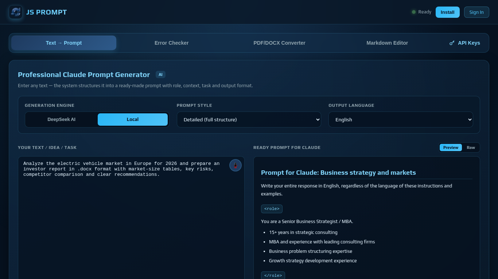
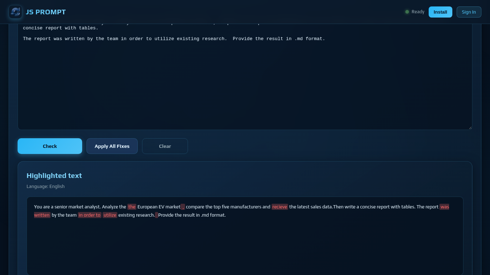
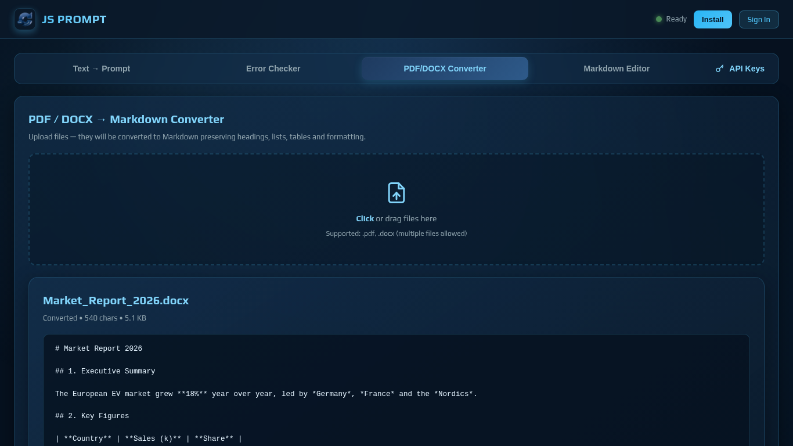
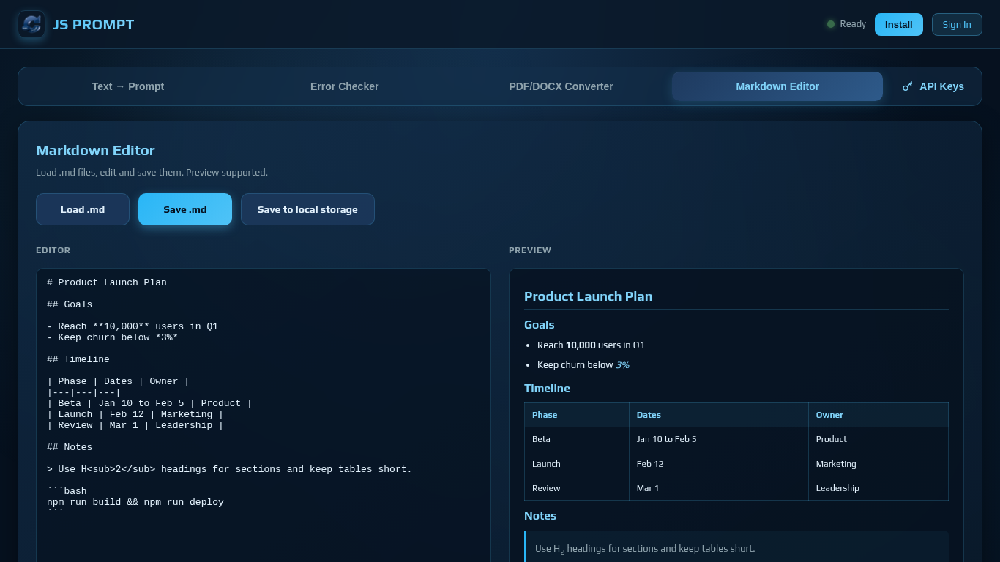
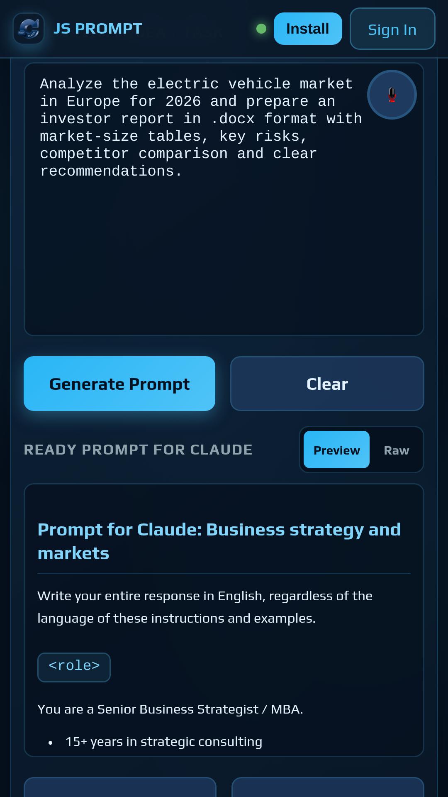
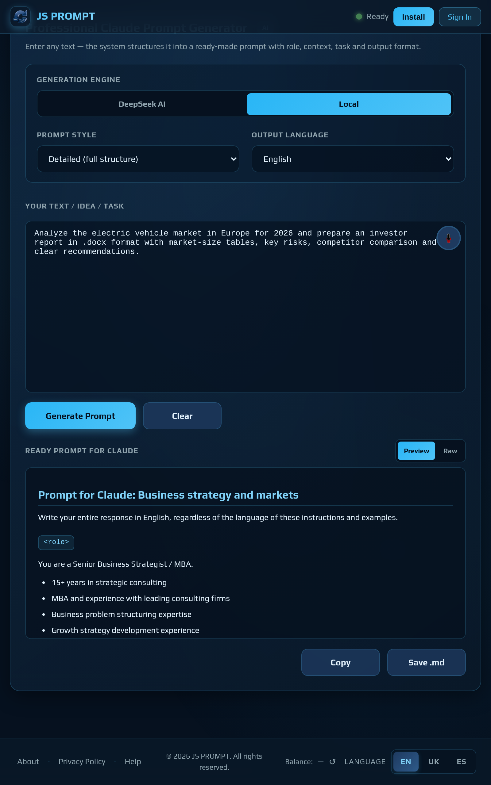
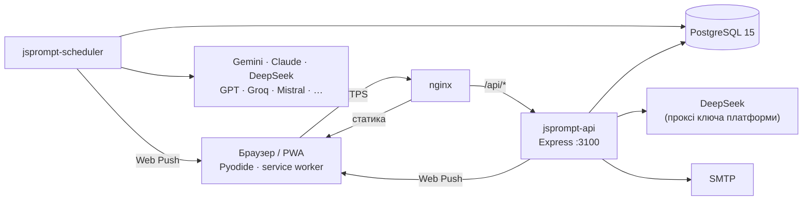

<div align="center">


# JS PROMPT

**PWA для створення професійних промтів для AI: текст → структурований промт, конвертер PDF/DOCX → Markdown, Markdown-редактор, перевірка помилок і планувальник запусків промтів у Gemini, Claude, DeepSeek та інших моделях**

[](https://promt.pp.ua)


[Сайт](https://promt.pp.ua) · [Встановлення](PROMT_PWA_DOCS/install_JS_PROMPT.md) · [API](PROMT_PWA_DOCS/api_js_prompt.md) · [Рев'ю коду](PROMT_PWA_DOCS/CodeRabbit_ClaudeCode.md)



</div>

---

## Зміст

- [Можливості](#можливості)
- [Скриншоти](#скриншоти)
- [Архітектура](#архітектура)
- [Технології](#технології)
- [Структура репозиторію](#структура-репозиторію)
- [Швидкий старт](#швидкий-старт)
- [Конфігурація](#конфігурація)
- [API](#api)
- [Розробка](#розробка)
- [Безпека](#безпека)
- [Документація](#документація)
- [Історія версій](#історія-версій)

---

## Можливості

### Для користувача

| Розділ | Що робить |
|---|---|
| **Текст → Промт** | перетворює довільний опис задачі на структурований промт за практиками Anthropic (XML-розділи `<role>`, `<context>`, `<task>`, `<constraints>`, `<output_format>`); домени, стилі, мова результату; рушії **Local** (без ключів, Python у браузері), **DeepSeek**, **Claude**, **Gemini** |
| **Голосове введення** | диктування задачі з перекладом |
| **Перевірка помилок** | контекстні правила для промтів, Markdown і тексту; перевірка орфографії EN; безпечні автовиправлення |
| **Конвертер PDF / DOCX → Markdown** | заголовки, списки, таблиці, виноски, верхні/нижні індекси, посилання |
| **Markdown-редактор** | редагування з попереднім переглядом |
| **Експорт** | `.md` і стилізований `.docx` |
| **Мої промти** | збереження, пошук, статистика за доменами й рушіями |
| **Планувальник** | запуск збереженого промту в обраній AI-моделі одноразово, щотижня, щомісяця або за власним розкладом; результати з історією, експорт, push-сповіщення |
| **API-ключі** | особисті ключі провайдерів (меню **API Keys**, `Ctrl+Shift+K`), імпорт/експорт, детальна довідка з отримання ключів |
| **PWA** | встановлення на ПК і телефон, робота офлайн для локальних функцій, адаптивний інтерфейс |
| **Мови інтерфейсу** | English, Українська, Español |

### Для адміністратора (`/admin.html`)

- користувачі: створення, ролі, блокування, видалення, ключі провайдерів;
- промти всіх користувачів: перегляд, редагування, копіювання, передача іншому власнику;
- довідник AI-провайдерів: URL, моделі, автентифікація, імпорт/експорт ([`deploy/ai-providers.json`](deploy/ai-providers.json));
- статистика платформи;
- резервні копії БД: створення, завантаження, відновлення з перевіркою SQL;
- розсилка листів про оновлення всім користувачам (тестовий лист, прогрес, продовження після перезапуску).

---

## Скриншоти

| Перевірка помилок | Конвертер PDF/DOCX | Markdown-редактор |
|---|---|---|
|  |  |  |

| Телефон | Планшет |
|---|---|
|  |  |

Повний набір для Microsoft Store і Google Play (від 640×480 до 3840×2160, телефон і планшет) — у теці
[`screenshots/`](screenshots/), він же підключений у [`manifest.json`](manifest.json).

---

## Архітектура



- **Фронтенд** — статичні файли без збірки; обчислення промтів і конвертація виконуються в браузері (Pyodide).
- **API** — акаунти (magic link або пароль, JWT), збереження промтів, ключі, адмін-функції, бекапи, розсилки.
- **Планувальник** — окремий процес: виконує заплановані промти, продовжує обірвані відповіді, повторює при
  перевантаженні провайдера, надсилає push.

---

## Технології

| Шар | Стек |
|---|---|
| Фронтенд | HTML, CSS, vanilla JS, Pyodide 0.25.1, marked 12, DOMPurify 3, JSZip 3.10 (локально), Web Speech API, Service Worker, Web Push |
| Бекенд | Node.js ≥ 20, Express 4, `pg`, `jsonwebtoken`, `bcrypt`, `nodemailer`, `helmet`, `express-rate-limit`, `web-push` |
| Дані | PostgreSQL 15 (`pgcrypto`, `pg_trgm`) |
| Інфраструктура | Debian 12, nginx, Let's Encrypt, systemd, Mailcow (SMTP) |
| Якість | CodeRabbit CLI + Claude Code |

---

## Структура репозиторію

```text
promt.pp.ua/
├── index.html               # основний застосунок (PWA)
├── admin.html, admin_help.html
├── prompt_help.html         # довідка користувача
├── key_api.html             # перевірка API-ключів провайдерів
├── coder.html               # обфускатор API-ключів
├── pp.html                  # політика конфіденційності
├── manifest.json, sw.js, push-client.js
├── js/
│   ├── prompt.js            # UI генератора, експорт, планувальник
│   ├── python_core.js       # Python-ядро (Pyodide): промти, конвертер, перевірка
│   ├── deepseek.js          # клієнт AI-рушіїв
│   ├── api-client.js, auth-ui.js
│   ├── md-export.js         # експорт .md / .docx
│   ├── language.js          # переклади EN / UK / ES
│   ├── admin.js, admin-lang.js
│   ├── voice_translate.js, spinner.js
│   └── vendor/jszip.min.js
├── css/                     # теми, адаптивність, сторінки
├── fonts/, png/, img/, screenshots/, cookie-banner/
├── api/
│   ├── server.js            # REST API
│   ├── scheduler.js         # планувальник завдань
│   └── package.json
├── db/
│   ├── schema.sql           # повна схема
│   └── migrations/
├── deploy/
│   ├── nginx/promt.pp.ua.conf
│   └── ai-providers.json    # довідник провайдерів для імпорту (без ключів)
├── mail/test-smtp.js        # перевірка SMTP
└── PROMT_PWA_DOCS/          # документація (закрита nginx)
```

---

## Швидкий старт

Повна покрокова інструкція — **[install_JS_PROMPT.md](PROMT_PWA_DOCS/install_JS_PROMPT.md)**. Коротко:

```bash
# 1. Пакети (Debian 12) + Node.js ≥ 20 з NodeSource
sudo apt install -y nginx certbot python3-certbot-nginx postgresql postgresql-contrib git gzip

# 2. Код
sudo -u promtops git clone git@github.com:bioluch/promt.pp.ua.git /var/www/promt.pp.ua

# 3. База: роль jsprompt_app — власник БД і схеми public; розширення pgcrypto, pg_trgm;
#    імпорт розділу 3 db/schema.sql (див. інструкцію, розділ 6)

# 4. Конфігурація та залежності
cd /var/www/promt.pp.ua && nano .env && chmod 600 .env
cd api && npm ci --omit=dev && npx web-push generate-vapid-keys

# 5. Сервіси, nginx, HTTPS
sudo systemctl enable --now jsprompt-api jsprompt-scheduler
sudo cp deploy/nginx/promt.pp.ua.conf /etc/nginx/sites-available/ && sudo nginx -t && sudo systemctl reload nginx
sudo certbot --nginx -d promt.pp.ua -d www.promt.pp.ua

# 6. Перевірка
curl -s https://promt.pp.ua/api/health
```

Після встановлення: зареєструйтеся, призначте собі роль `admin` у БД, імпортуйте
[`deploy/ai-providers.json`](deploy/ai-providers.json) в адмін-панелі.

---

## Конфігурація

Усі налаштування — у `/var/www/promt.pp.ua/.env` (права `600`, ігнорується git, закритий nginx).

| Група | Змінні |
|---|---|
| Застосунок | `APP_URL`, `NODE_ENV`, `PORT` |
| PostgreSQL | `PG_HOST`, `PG_PORT`, `PG_DB`, `PG_USER`, `PG_PASSWORD` |
| JWT | `JWT_SECRET`, `JWT_REFRESH_SECRET` |
| Пошта | `MAIL_HOST`, `MAIL_PORT`, `MAIL_USER`, `MAIL_PASS`, `MAIL_FROM` |
| Web Push | `VAPID_PUBLIC_KEY`, `VAPID_PRIVATE_KEY`, `VAPID_SUBJECT` |
| AI-ключі платформи | `DEEPSEEK_API_KEY`, `GEMINI_API_KEY`, `CLAUDE_API_KEY` (необов'язкові) |
| Інше | `BACKUP_DIR` (типово `/var/lib/jsprompt/backups`), `SCHEDULER_INTERVAL_MS` |

Опис кожної змінної — в [інструкції, розділ 7](PROMT_PWA_DOCS/install_JS_PROMPT.md#7--файл-конфігурації-env).

---

## API

REST API на `https://promt.pp.ua/api`, JSON, автентифікація `Authorization: Bearer <JWT>`.

| Група | Маршрути |
|---|---|
| Auth | `/auth/send-link`, `/auth/verify`, `/auth/register`, `/auth/login`, `/auth/refresh`, `/auth/logout`, `/auth/me`, паролі |
| Дані користувача | `/sources`, `/prompts`, `/stats`, `/jobs`, `/push/*`, `/user-keys`, `/custom-providers` |
| AI | `/deepseek/chat`, `/deepseek/balance`, `/env` |
| Адміністрування | `/admin/users`, `/admin/prompts`, `/admin/provider-endpoints`, `/admin/stats`, `/admin/backup/*`, `/admin/announcements/*` |
| Моніторинг | `/health` |

Повний довідник із тілами запитів, відповідями, кодами помилок і лімітами — **[api_js_prompt.md](PROMT_PWA_DOCS/api_js_prompt.md)**.

---

## Розробка

```bash
git checkout -b fix/<назва>             # роботу ведемо в гілках, main — стабільна
node --check api/server.js api/scheduler.js
sudo systemctl restart jsprompt-api jsprompt-scheduler
journalctl -u jsprompt-api -f
```

- Після змін фронтенду збільшуйте `CACHE_NAME` у [`sw.js`](sw.js) — інакше користувачі довше бачитимуть стару версію.
- Зміни схеми БД — новим файлом у `db/migrations/` (ідемпотентний SQL) і оновленням `db/schema.sql`.
- Перед злиттям у `main` — рев'ю CodeRabbit: [CodeRabbit_ClaudeCode.md](PROMT_PWA_DOCS/CodeRabbit_ClaudeCode.md).
- Нові рядки інтерфейсу — у [`js/language.js`](js/language.js) для всіх трьох мов.

---

## Безпека

- секрети лише в `.env`; ключ DeepSeek платформи не передається в браузер — тільки через проксі `/api/deepseek/chat`;
- паролі — bcrypt (12 раундів); refresh-токени й одноразові посилання зберігаються як SHA-256;
- ліміти запитів на `/api/*`, `/api/auth/*` і проксі DeepSeek;
- сервіси працюють від `www-data` з `ProtectSystem=strict`, API слухає лише `127.0.0.1`;
- nginx повертає 404 для серверного коду, `.env`, `.git`, дампів, `db/`, `deploy/`, документації;
  заголовки HSTS, CSP, `nosniff`;
- бекапи поза веб-коренем; відновлення перевіряє SQL на мета-команди `psql`.

Про вразливості повідомляйте на admin@promt.pp.ua, а не через публічні issue.

---

## Документація

| Документ | Зміст |
|---|---|
| [install_JS_PROMPT.md](PROMT_PWA_DOCS/install_JS_PROMPT.md) | встановлення й налаштування сервера та застосунку |
| [api_js_prompt.md](PROMT_PWA_DOCS/api_js_prompt.md) | довідник REST API |
| [CodeRabbit_ClaudeCode.md](PROMT_PWA_DOCS/CodeRabbit_ClaudeCode.md) | рев'ю коду: CodeRabbit CLI + Claude Code |
| [prompt_help.html](https://promt.pp.ua/prompt_help.html) | довідка користувача |
| [admin_help.html](https://promt.pp.ua/admin_help.html) | довідка адміністратора |

---

## Історія версій

### 2.0.0 — жовтень 2026

- генератор промтів v2 за практиками Claude, без емодзі; стилізований експорт `.md` / `.docx`;
- професійний конвертер DOCX → Markdown (таблиці, виноски, індекси);
- нова перевірка помилок: контекстні правила, орфографія EN, безпечні виправлення;
- меню **API Keys**, попередження про відсутній ключ, довідка з ключів різних провайдерів;
- планувальник: бюджет з урахуванням «мислення» моделей, автоматичне продовження відповіді;
- адмін-панель: розсилка листів про оновлення, безпечні бекапи й відновлення;
- симетричний інтерфейс, мобільна адаптація, скриншоти для магазинів застосунків;
- посилена конфігурація nginx, виправлення за рев'ю CodeRabbit.

### 1.0.0

Перший публічний реліз PWA.

---

<div align="center"><sub>© 2026 promt.pp.ua · JS PROMPT</sub></div>
